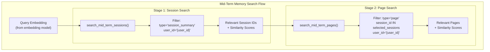

# storage_provider.py 详细分析
1. **核心设计目标**
- 替代传统的 JSON 文件和 Faiss 索引，提供更高效的向量存储与检索能力
- 统一管理多类型记忆数据（短期对话、中期会话、长期知识、用户画像）
- 支持向量相似度搜索，为记忆召回提供基础
- 保证数据持久化与一致性

2. **初始化与核心组件**
```python
class ChromaStorageProvider:
    def __init__(self, path: str, user_id: str, assistant_id: str, distance_function: str = "cosine"):
        self.path = path  # 数据存储路径
        self.user_id = user_id  # 用户唯一标识
        self.assistant_id = assistant_id  # 助手唯一标识
        self.distance_function = distance_function  # 向量距离计算方式（默认余弦距离）
        
        # 初始化 ChromaDB 客户端
        self.client = chromadb.PersistentClient(path=path)
        
        # 创建/获取 3 个核心集合（Collection）
        self.mid_term_collection = self._get_or_create_collection_with_space(f"mid_term_memory_user_{user_id}")
        self.user_knowledge_collection = self._get_or_create_collection_with_space(f"user_knowledge_{user_id}")
        self.assistant_knowledge_collection = self._get_or_create_collection_with_space(f"assistant_knowledge_{assistant_id}")
        
        # 元数据文件（存储非向量数据，如会话元信息、访问频率等）
        self.metadata_file = os.path.join(path, f"metadata_{user_id}_{assistant_id}.json")
        self.metadata = self._load_metadata()  # 加载元数据
```

## ChromaDB 集合分工：
mid_term_collection：存储中期记忆的会话摘要和对话页面向量
user_knowledge_collection：存储用户私有知识向量
assistant_knowledge_collection：存储助手知识库向量
元数据文件：存储无法用向量表示的结构化数据（如会话元信息、短期记忆队列等），通过 JSON 文件持久化：
```python
def _load_metadata(self) -> dict:
    # 加载元数据（若文件不存在则初始化默认结构）
    try:
        if os.path.exists(self.metadata_file):
            with open(self.metadata_file, 'r', encoding='utf-8') as f:
                return json.load(f)
    except (FileNotFoundError, json.JSONDecodeError):
        pass  # 加载失败则使用默认结构
    
    return {
        "mid_term_sessions": {},  # 中期会话元信息
        "access_frequency": {},   # 会话访问频率（用于 LFU 淘汰）
        "heap_state": [],         # 中期记忆堆状态（用于热度排序）
        "short_term_memory": [],  # 短期记忆队列
        "user_profiles": {},      # 用户画像
        "update_times": {}        # 数据更新时间戳
    }

def save_all_metadata(self):
    # 保存元数据到 JSON 文件（唯一写文件的方法）
    with open(self.metadata_file, 'w', encoding='utf-8') as f:
        json.dump(self.metadata, f, ensure_ascii=False, indent=2)
```
ChromaStorageProvider 类中维护了一个统一的元数据字典字典 self.metadata，用于管理短期记忆、中期会话信息、访问频率、堆状态等非向量数据。这个字典通过 JSON 文件持久化存储，并在初始化时加载。所以每次存储使用的是w。
集中读写：所有元数据的修改都直接操作 self.metadata，并通过 save_all_metadata 方法统一写入文件（确保数据一致性）。
初始化与加载：通过 _load_metadata 方法确保字典结构的完整性，即使文件不存在也会初始化默认字段。
### 短期记忆管理：存储最近的对话对，采用队列结构，支持容量限制
```python
def add_short_term_memory(self, qa_pair: dict):
    # 添加对话对到短期记忆（自动补全时间戳）
    if 'timestamp' not in qa_pair:
        qa_pair["timestamp"] = get_timestamp()
    self.metadata.setdefault("short_term_memory", []).append(qa_pair)

def get_short_term_memory(self, max_capacity: int) -> deque:
    # 获取短期记忆（用 deque 保证容量限制）
    return deque(self.metadata.get("short_term_memory", []), maxlen=max_capacity)

def pop_oldest_short_term(self) -> Optional[dict]:
    # 移除最旧的对话对（当容量满时）
    memory_list = self.metadata.get("short_term_memory", [])
    return memory_list.pop(0) if memory_list else None
```
### 中期记忆管理：存储会话级别的对话片段，支持向量检索和会话合并
会话元信息（如热度、关键词）存储在 metadata 中, 会话摘要和页面内容的向量存储在 mid_term_collection 中，用于相似度检索
#### 会话与页面存储
1. ChromaDB 中的向量存储（mid_term_collection）

会话摘要（Session Summary）：
- ids：格式为 session_{session_id}
- embeddings：会话摘要的向量
- metadatas：包含 type: "session_summary"、session_id、summary、timestamp、user_id 等元信息。

对话页面（Page）：
- ids：格式为 page_{page_id}
- embeddings：单轮对话（用户输入 + 助手回复）的向量
- metadatas：包含 type: "page"、session_id、page_id、user_input、agent_response、timestamp 等元信息。

2. 元数据 JSON 中的结构化信息（metadata["mid_term_sessions"]）
每个会话在元数据中对应一个字典：
```python
{
  "id": "session_xxx",  # 会话唯一ID
  "summary": "会话摘要文本",
  "summary_keywords": ["关键词1", "关键词2"],  # 会话关键词
  "L_interaction": 5,  # 会话包含的对话轮数
  "R_recency": 0.8,    # 时效性分数
  "N_visit": 3,        # 访问次数
  "H_segment": 0.9,    # 热度分数
  "timestamp": "2024-05-01 10:00:00",  # 创建时间
  "last_visit_time": "2024-05-02 15:00:00",  # 最后访问时间
  "access_count_lfu": 2,  # LFU淘汰策略的访问计数
  "page_count": 5,  # 页面数量
  "pages_backup": [  # 页面详细信息备份（非向量数据）
    {
      "page_id": "page_yyy",
      "user_input": "用户输入内容",
      "agent_response": "助手回复内容",
      "timestamp": "2024-05-01 10:01:00",
      "pre_page": "page_zzz",  # 上一页ID
      "next_page": "page_aaa",  # 下一页ID
      "meta_info": "页面元信息",
      "page_keywords": ["页面关键词"]
    },
    # ... 更多页面
  ]
}
```
ChromaDB 对 Page 和 Session 是否分库？
不分库，而是通过同一集合（mid_term_collection）中的元数据区分：
- 所有会话摘要（Session）和对话页面（Page）的向量都存储在同一个 ChromaDB 集合 mid_term_collection 中。
- 区分方式：通过**元数据中的 type 字段（"session_summary" 或 "page"）**，以及 session_id 关联所属会话。
- 优势：简化集合管理，查询时可通过 where 条件（如 {"type": "session_summary"}）快速过滤类型，同时支持跨类型关联查询（如根据会话 ID 查询所属页面）。


```python
def add_mid_term_session(self, session_data: dict, pages: List[dict]):
    # 1. 保存会话元信息到 metadata（非向量数据）
    session_id = session_data["id"]
    self.metadata["mid_term_sessions"][session_id] = {
        "id": session_id,
        "summary": session_data["summary"],
        "summary_keywords": session_data["summary_keywords"],
        "L_interaction": session_data["L_interaction"],  # 交互长度
        "H_segment": session_data["H_segment"],          # 热度值
        # ... 其他元信息
        "pages_backup": [{"page_id": p["page_id"], "user_input": p["user_input"], ...} for p in pages]
    }
    
    # 2. 存储会话摘要向量到 ChromaDB
    self.mid_term_collection.add(
        embeddings=[session_data["summary_embedding"]],
        metadatas=[{"type": "session_summary", "session_id": session_id, ...}],
        ids=[f"session_{session_id}"]
    )
    
    # 3. 存储对话页面向量到 ChromaDB
    page_embeddings = [p["page_embedding"] for p in pages if "page_embedding" in p]
    page_ids = [f"page_{p['page_id']}" for p in pages if "page_embedding" in p]
    self.mid_term_collection.add(embeddings=page_embeddings, metadatas=[...], ids=page_ids)
```
#### 会话与页面检索
```python
def search_mid_term_sessions(self, query_embedding: List[float], top_k: int = 5) -> List[dict]:
    # 检索与查询向量相似的会话
    results = self.mid_term_collection.query(
        query_embeddings=[query_embedding],
        n_results=top_k,
        where={"type": "session_summary", "user_id": self.user_id}  # 过滤会话摘要类型
    )
    # 转换距离为相似度（余弦距离 -> 相似度：1 - 距离）
    return [{
        "session_id": metadata["session_id"],
        "session_relevance_score": self._distance_to_similarity(distance),
        ...
    } for metadata, distance in zip(results["metadatas"][0], results["distances"][0])]

def search_mid_term_pages(self, query_embedding: List[float], session_ids: List[str], top_k: int = 10) -> List[dict]:
    # 检索特定会话中与查询相关的页面
    results = self.mid_term_collection.query(
        query_embeddings=[query_embedding],
        where={"type": "page", "session_id": {"$in": session_ids}},  # 过滤页面类型和指定会话
        n_results=top_k
    )
    # 处理结果并返回页面详情
```

#### 会话淘汰与更新
```python
def delete_mid_term_session(self, session_id: str):
    # 从 metadata 和 ChromaDB 中删除会话
    if session_id in self.metadata["mid_term_sessions"]:
        del self.metadata["mid_term_sessions"][session_id]
    self.mid_term_collection.delete(where={"session_id": session_id})  # 删除相关向量

def update_access_frequency(self, session_id: str, count: int):
    # 更新会话访问频率（用于 LFU 淘汰策略）
    self.metadata["access_frequency"][session_id] = count
```

### 长期知识管理
#### 用户私有知识和助手知识库，支持向量存储与检索
```pyhon
def add_user_knowledge(self, text: str, embedding: List[float]):
    # 添加用户知识到 ChromaDB
    metadata = {"type": "user_knowledge", "timestamp": get_timestamp(), "text": text}
    self._add_knowledge(self.user_knowledge_collection, text, embedding, metadata)

def search_user_knowledge(self, query_embedding: List[float], top_k: int = 5) -> List[dict]:
    # 检索与查询相关的用户知识
    return self._search_knowledge(self.user_knowledge_collection, query_embedding, top_k)

def enforce_knowledge_capacity(self, knowledge_type: str, max_capacity: int):
    # 当知识数量超过上限时，删除最旧的知识（按时间戳排序）
    collection = self.user_knowledge_collection if knowledge_type == "user" else self.assistant_knowledge_collection
    current_count = collection.count()
    if current_count > max_capacity:
        # 按时间戳排序并删除超额部分
        ...
```
#### 用户画像管理：用户画像存储在元数据中，支持更新与查询
```python
def update_user_profile(self, user_id: str, profile_data: Dict[str, Any]):
    # 更新用户画像
    self.metadata["user_profiles"][user_id] = profile_data

def get_user_profile(self, user_id: str) -> Optional[Dict[str, Any]]:
    # 获取用户画像
    return self.metadata["user_profiles"].get(user_id)
```
### 核心工具方法
- `_distance_to_similarity`：将向量距离（如余弦距离）转换为相似度分数（0~1）
- `_safe_str` / `_safe_metadata`：确保元数据值可安全序列化（如将列表 / 字典转为 JSON 字符串）
- `_get_or_create_collection_with_space`：创建带距离函数配置的 ChromaDB 集合

## Enhanced Search Capabilities
ChromaDB 相比传统的文件存储（如 JSON 文件）或轻量向量搜索库（如 PyPI 上的简单向量匹配工具），主要在以下几个方面实现了优化，尤其在搜索能力上有显著提升

1. **高效的向量索引与搜索性能**

**内置索引结构**：ChromaDB 默认使用 **HNSW（Hierarchical Navigable Small World）** 索引（通过 hnsw:space 配置），这是一种专为高维向量设计的近似最近邻（ANN）搜索算法。相比暴力搜索（遍历所有向量计算距离）或简单的 k-d 树，HNSW 能在保证搜索质量的前提下，将查询时间复杂度从 O (n) 降至接近 **O (log n)**，尤其在向量数量庞大（如上万级）时，搜索速度提升明显。
**距离函数适配**：支持余弦相似度、L2 距离、内积等多种距离度量（通过 distance_function 配置），并在代码中通过 _distance_to_similarity 方法统一转换为相似度分数，适配不同场景的搜索需求，而无需手动实现距离计算逻辑。
2. **结构化元数据过滤与联合查询**

**元数据条件过滤**：ChromaDB 允许在搜索时结合向量相似度和元数据条件（如 where 子句）。这种能力避免了 “先搜索所有向量再过滤元数据” 的低效方式，直接在索引层结合条件筛选，减少无效计算。例如：
```python
# 仅搜索特定用户的会话摘要
self.mid_term_collection.query(
    query_embeddings=[query_embedding],
    where={"$and": [{"type": "session_summary"}, {"user_id": self.user_id}]}
)
```
**跨类型关联查询**：中期记忆中同时存储 “会话摘要” 和 “对话页面” 两种向量，但通过 type 字段区分。搜索时可先定位相关会话，再在会话内搜索页面（如 search_mid_term_pages 方法），实现层级化查询，而传统文件存储需手动维护关联关系，查询逻辑复杂。

3. **持久化与并发安全**

**开箱即用的持久化**：ChromaDB 的 PersistentClient 自动处理向量和元数据的持久化，无需手动编写文件读写逻辑（如 JSON 序列化 / 反序列化），避免了文件锁、数据损坏等问题。
**并发访问支持**：内置对多线程 / 进程访问的处理，相比直接操作 JSON 文件（易出现并发写冲突），更适合多任务场景（如代码中的 ThreadPoolExecutor 并行处理）。

4. **动态数据管理**

**增量更新与删除**：支持单条 / 批量向量的添加、更新、删除（如 add、delete 方法），而传统向量文件存储若要删除一条数据，需重新写入整个文件，效率极低。
**容量控制**：在长期记忆（enforce_knowledge_capacity 方法）中，可通过按时间戳排序删除旧数据，结合 ChromaDB 的 get 和 delete 接口高效实现，无需手动解析和重写整个向量集。
5. **与应用层的无缝集成**
**简化代码逻辑**：封装了向量存储的底层细节（如索引维护、数据持久化），应用层只需调用 add_mid_term_session、search_mid_term_sessions 等方法，无需关注向量如何存储和检索。
**缓存与复用**：通过 _model_cache 和 _embedding_cache 减少重复计算，结合 ChromaDB 的查询接口，进一步提升端到端搜索效率。

### Mid-Term Memory Search
ChromaDB 变体为中期记忆提供两阶段语义搜索：
会话级搜索 ：使用 `search_mid_term_sessions（）` 根据摘要嵌入查找相关对话会话
页面级搜索 ：使用 `search_mid_term_pages（）` 在已识别的会话中查找特定的 QA 对

### Knowledge Base Search
用户和助手知识集合都支持直接语义搜索：
`search_user_knowledge（）`：搜索用户的个人知识库
`search_assistant_knowledge（）`：搜索助手的专业知识

## 嵌入模型配置
Memoryos 类为嵌入模型提供了智能默认值，也可以自定义 SentenceTransformer 模型
[chromadb_memoryos.py](../memoryos-chromadb/memoryos.py)
```python
# Smart defaults for embedding_model_kwargs
if 'bge-m3' in self.embedding_model_name.lower():
    self.embedding_model_kwargs = {'use_fp16': True}
else:
    self.embedding_model_kwargs = {}
```
实际的 ChromaDB 存储是在 创建的 `{data_storage_path}/chroma_storage/`


