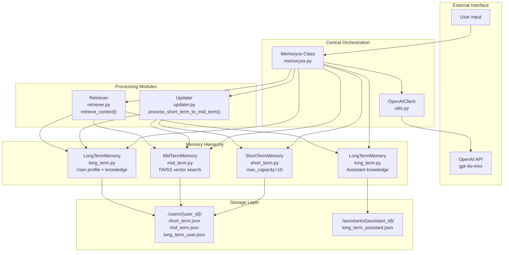
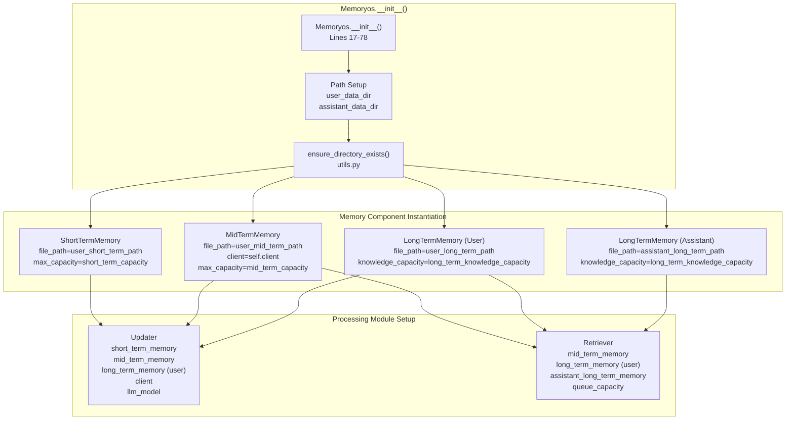
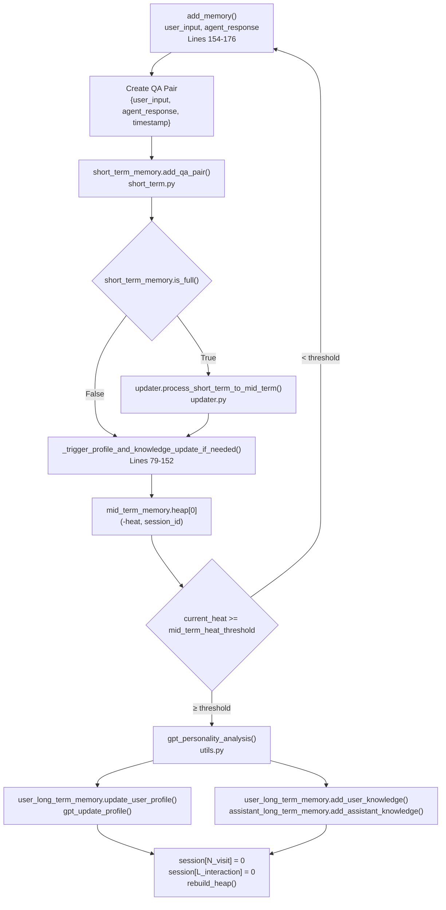
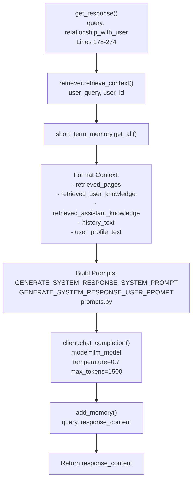
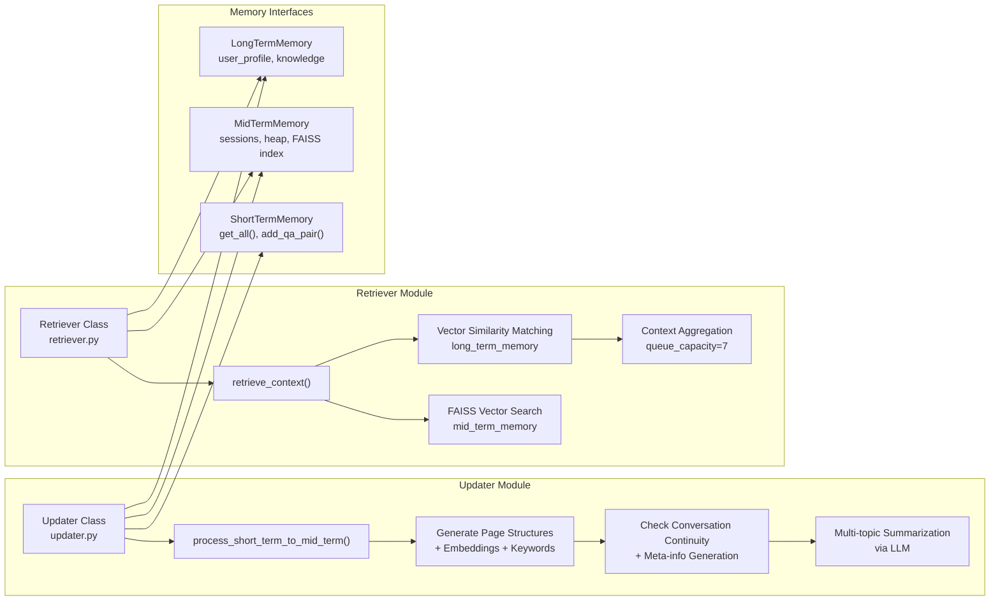
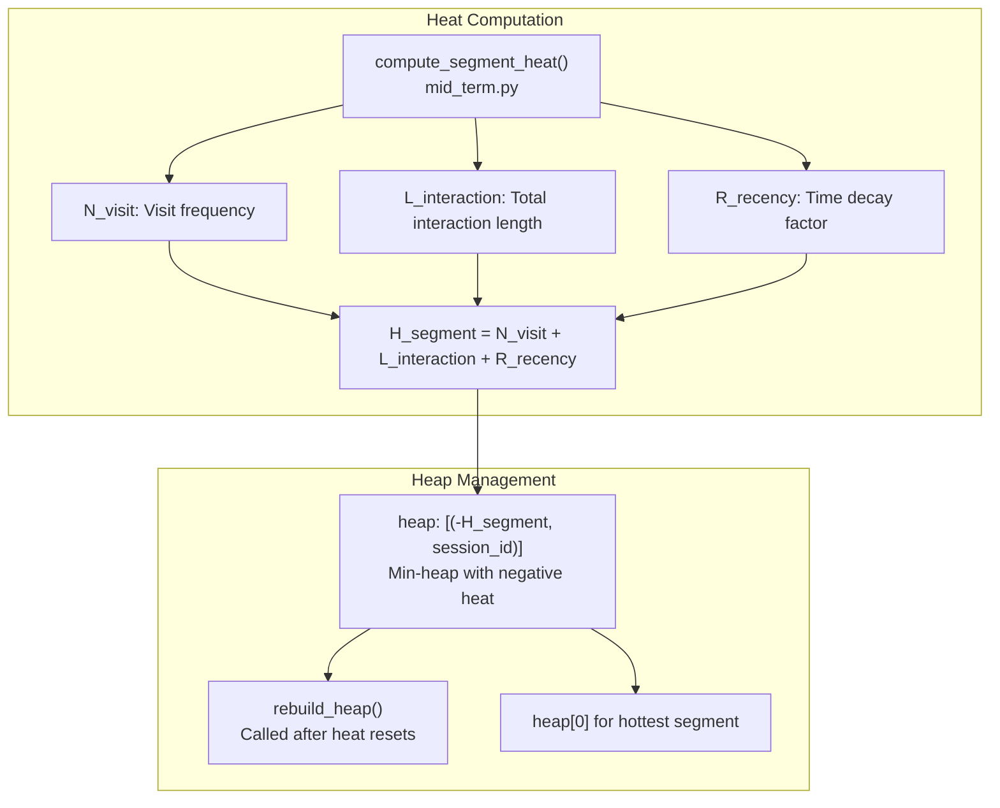
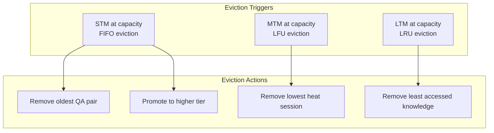
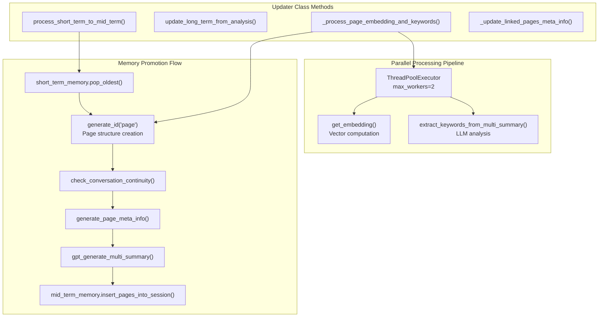

# 核心架构
## 核心系统组件


## 分层内存架构
### 内存层初始化和协调

### Heat-Based Memory Promotion System
该系统使用复杂的热度计算机制来确定中期记忆片段何时应触发长期记忆中的配置文件和知识更新。
|Component|	Trigger Condition  |	Action |	Heat Reset |
|--|--|--|--|
|Short-term to Mid-term  |	is_full() capacity reached|	process_short_term_to_mid_term()|	N/A |
|Mid-term to Long-term |current_heat >= mid_term_heat_threshold|gpt_personality_analysis()	|N_visit=0, L_interaction=0</br>N_visit=0，L_interaction=0|

## 核心编排模式
Memoryos 类充当中央编排器，实现两个主要工作流程：内存添加和响应生成。

## 响应生成工作流程


## 更新程序和检索器集成

## 内存层次架构
### Heat Calculation and Heap Management

### 容量管理和逐出容量管理和逐出
| Tier | Capacity Parameter | Eviction Strategy | Implementation |
|------|-------------------|-------------------|----------------|
| Short-Term | `short_term_capacity` (default: 10) | FIFO - oldest entries removed | Queue-based in `short_term.py` |
| Mid-Term | `mid_term_capacity` (default: 2000) | LFU - least frequently used | Heat-based scoring in `mid_term.py` |
| Long-Term | `long_term_knowledge_capacity` (default: 100) | LRU - least recently used | Profile-based in `long_term.py` |


## 加工模块
### 更新模块并行处理架构
参考[chromadb_updater.py](../memoryos-chromadb/updater.py)

Updater 类连接短期记忆（ShortTermMemory）、中期记忆（MidTermMemory）和长期记忆（LongTermMemory），通过以下关键流程实现记忆管理：
将短期记忆中溢出的对话迁移至中期记忆，并构建结构化的对话页面（Page）。
对迁移的对话进行主题分析、关联性判断，形成连贯的会话片段（Session）。
基于中期记忆的分析结果，更新长期记忆中的用户画像和知识。
1. 类与初始化参数
```python
class Updater:
    def __init__(self, 
                 short_term_memory: ShortTermMemory, 
                 mid_term_memory: MidTermMemory, 
                 long_term_memory: LongTermMemory, 
                 client: OpenAIClient,
                 topic_similarity_threshold=0.5,
                 llm_model="gpt-4o-mini"):
        # 初始化关联的记忆模块、LLM客户端及配置参数
        self.short_term_memory = short_term_memory  # 短期记忆实例
        self.mid_term_memory = mid_term_memory      # 中期记忆实例
        self.long_term_memory = long_term_memory    # 长期记忆实例
        self.client = client                        # OpenAI客户端（用于LLM调用）
        self.topic_similarity_threshold = topic_similarity_threshold  # 主题相似度阈值
        self.last_evicted_page_for_continuity = None  # 上一次迁移的最后一个页面（用于对话连续性判断）
        self.llm_model = llm_model                  # 用于分析的LLM模型
```
通过关联三个记忆层级的实例，实现跨层级数据操作。
topic_similarity_threshold 控制对话主题的相似度判断阈值，llm_model 指定用于生成摘要、关键词的模型。

2. `_process_page_embedding_and_keywords`：页面向量与关键词生成
```python
def _process_page_embedding_and_keywords(self, page_data):
    # 并行计算页面的embedding和关键词（若不存在）
    full_text = f"User: {page_data.get('user_input','')} Assistant: {page_data.get('agent_response','')}"
    tasks = []
    if not page_data.get("page_embedding"):
        tasks.append(('embedding', lambda: get_embedding(full_text)))  # 生成向量
    if not page_data.get("page_keywords"):
        tasks.append(('keywords', lambda: extract_keywords_from_multi_summary(full_text, client=self.client)))  # 提取关键词
    # 并行执行任务并更新页面数据
    with ThreadPoolExecutor(max_workers=2) as executor:
        # ... 执行并处理结果 ...
    return page_data
```
功能：为每个对话页面（Page）生成向量表示（用于后续检索）和关键词（用于主题分析）。
优化：通过线程池并行计算向量和关键词，提升处理效率。
复用性：若页面已包含向量或关键词，则跳过计算，避免重复消耗资源。

3. `_update_linked_pages_meta_info`：更新关联页面的元信息
```python
def _update_linked_pages_meta_info(self, start_page_id, new_meta_info):
    # 广度优先遍历（BFS）更新所有关联页面的元信息
    q = [start_page_id]
    visited = {start_page_id}
    while q:
        current_page_id = q.pop(0)
        page = self.mid_term_memory.get_page_by_id(current_page_id)
        if page:
            page["meta_info"] = new_meta_info  # 更新元信息
            # 递归处理上一页和下一页
            if page.get("pre_page") not in visited:
                q.append(page["pre_page"])
                visited.add(page["pre_page"])
            if page.get("next_page") not in visited:
                q.append(page["next_page"])
                visited.add(page["next_page"])
    self.mid_term_memory.save()
```
功能：当对话页面形成连贯序列（如多轮对话）时，统一更新所有关联页面的元信息（如主题标签），确保序列内信息一致性。
实现：通过 BFS 遍历页面的前驱和后继节点，形成 “链式更新”。
> 为什么要使用BFS进行更新？
>【总结】**BFS 的作用是遍历完整的对话链条，确保所有关联页面的元信息同步更新**；而 ChromaDB 在此场景中主要负责向量存储和检索，**页面间的关联关系仍依赖传统的链式结构和 JSON 元数据管理**。两者分工不同，BFS 的使用是由业务逻辑（对话连续性维护）决定的，与 ChromaDB 的存储形式无关。
> 详细说明：
在 `_update_linked_pages_meta_info` 方法中使用 BFS（广度优先搜索）的原因与页面之间的链式关联结构密切相关，而 ChromaDB 中元信息的存储形式（JSON 或其他格式）并不影响这一设计选择。具体原因如下：
> - MemoryOS 中的对话页面（Page）通过 `pre_page`（前一页）和 `next_page`（后一页）形成**双向链表结构**，用于表示对话的连续性（例如：多轮对话形成的连贯序列）。当某一页的元信息（`meta_info`）更新时，需要同步更新其关联的所有页面（前驱和后继页面），以保证整个对话链条的元信息一致性。
**BFS 适合这种场景的原因**：
可以从起始页面（start_page_id）出发，逐层遍历所有前驱和后继页面，确保不遗漏任何关联节点。
避免递归调用可能导致的栈溢出问题（尤其当对话链条较长时）。
> - **ChromaDB 中元信息的存储与访问方式**
虽然 ChromaDB 是向量数据库，但在该实现中：页面的核心元信息（如 pre_page、next_page、meta_info 等）实际存储在辅助 **JSON 文件**中（通过 ChromaStorageProvider 的 metadata_file 管理，见 storage_provider.py）。
ChromaDB 主要用于存储页面和会话的向量嵌入（Embedding），以便高效检索，而**页面间的关联关系仍依赖传统的 ID 引用（类似链表的指针）**。
因此，更新元信息时需要：
1)通过 get_page_by_id 从 JSON 元数据中读取页面的 pre_page 和 next_page。
2)用 BFS 遍历整个关联链条，逐个更新每个页面的 meta_info。
3)最后通过 mid_term_memory.save() 将更新后的元数据写回 JSON 文件。


4. `process_short_term_to_mid_term`：短期记忆迁移至中期记忆
这是 Updater 最核心的方法，负责将短期记忆中溢出的对话（evicted_qas）迁移至中期记忆，并进行结构化处理：
1）提取短期记忆中溢出的对话：短期记忆采用 “先进先出” 策略，溢出的对话是最早进入的内容，需要迁移到中期记忆长期保存。
2）将 QA 对转换为页面（page）并判断语义连续性：每个 QA 对会被封装为一个 page 对象，包含对话内容、时间戳等元信息，同时通过 check_conversation_continuity 函数判断当前页面与上一页面是否属于同一对话主题。
3）完成页面构建后，方法会对批量页面生成多主题摘要（multi_summary_result），并按主题将页面分配到中期记忆的会话中：
```python
# from updater.py
def process_short_term_to_mid_term(self):
    # 1. 从短期记忆中取出溢出的对话（QA对）
    evicted_qas = []
    while self.short_term_memory.is_full():
        qa = self.short_term_memory.pop_oldest()  # 取出最旧的QA
        evicted_qas.append(qa)
    
    # 2. 将每个QA对转换为一个页面（Page）并判断对话连续性
    current_batch_pages = []
    temp_last_page_in_batch = self.last_evicted_page_for_continuity  # 上一次迁移的最后一个页面
    for qa_pair in evicted_qas:
        current_page_obj = {
            "page_id": generate_id("page"),
            "user_input": qa_pair["user_input"],
            "agent_response": qa_pair["agent_response"],
            "pre_page": None,  # 前驱页面ID（默认无）
            "next_page": None,  # 后继页面ID（默认无）
            "meta_info": None  # 页面元信息（主题摘要等）
        }

        # 判断当前页面与上一页面是否连续（基于LLM分析）
        is_continuous = check_conversation_continuity(temp_last_page_in_batch, current_page_obj, self.client)
        if is_continuous: # 若连续，则建立页面间的关联
            current_page_obj["pre_page"] = temp_last_page_in_batch["page_id"]  # 建立前驱关联
            
            # 同步更新上一页面所在链条的所有元信息（确保主题一致性）
            if temp_last_page_in_batch.get("page_id") and self.mid_term_memory.get_page_by_id(temp_last_page_in_batch["page_id"]):
                self._update_linked_pages_meta_info(temp_last_page_in_batch["page_id"], new_meta)
        else:
            # 若不连续，则当前页面为新链条的起点，生成独立元信息
            current_page_obj["meta_info"] = generate_page_meta_info(
                None, current_page_obj, self.client, model=self.llm_model
            )
        
        # 更新“上一页面”为当前页面，用于下一轮判断
        current_batch_pages.append(current_page_obj)
        temp_last_page_in_batch = current_page_obj
    
    # 3. 生成批量对话的主题摘要
    input_text_for_summary = "\n".join([f"User: {p['user_input']}\nAssistant: {p['agent_response']}" for p in current_batch_pages])
    multi_summary_result = gpt_generate_multi_summary(input_text_for_summary, self.client)  # LLM生成多主题摘要
    
    # 4. 将页面插入中期记忆的会话（Session）中
    if multi_summary_result.get("summaries"):
        for summary_item in multi_summary_result["summaries"]:
            # 按主题将页面分配到已有会话或新建会话
            self.mid_term_memory.insert_pages_into_session(
                summary_for_new_pages=summary_item["content"],
                keywords_for_new_pages=summary_item["keywords"],
                pages_to_insert=current_batch_pages,
                similarity_threshold=self.topic_similarity_threshold
            )
    # ... 处理异常情况（如无摘要时的 fallback）

def generate_page_meta_info(last_page_meta, current_page, client: OpenAIClient, model="gpt-4o-mini"):
    new_dialogue = f"User: {current_page.get('user_input', '')}\nAssistant: {current_page.get('agent_response', '')}"
    
    prompt = prompts.META_INFO_USER_PROMPT.format(
        last_meta=last_page_meta or "This is the beginning of the conversation.",
        new_dialogue=new_dialogue
    )
    messages = [{"role": "system", "content": prompts.META_INFO_SYSTEM_PROMPT}, {"role": "user", "content": prompt}]
    
    return client.chat_completion(model, messages, temperature=0.3) 

def gpt_generate_multi_summary(text, client: OpenAIClient, model="gpt-4o-mini"):
    messages = [
        {"role": "system", "content": prompts.MULTI_SUMMARY_SYSTEM_PROMPT},
        {"role": "user", "content": prompts.MULTI_SUMMARY_USER_PROMPT.format(text=text)}
    ]
    print("Calling LLM to generate multi-topic summary...")
    response_text = client.chat_completion(model=model, messages=messages)
    try:
        summaries = json.loads(response_text)
    except json.JSONDecodeError:
        print(f"Warning: Could not parse multi-summary JSON: {response_text}")
        summaries = []
    return {"input": text, "summaries": summaries}

# from utils.py
def check_conversation_continuity(previous_page, current_page, client: OpenAIClient, model="gpt-4o-mini"):
    if not previous_page or not current_page:
        return False
    
    prompt = prompts.CONTINUITY_CHECK_USER_PROMPT.format(
        prev_user=previous_page.get('user_input', ''),
        prev_agent=previous_page.get('agent_response', ''),
        curr_user=current_page.get('user_input', ''),
        curr_agent=current_page.get('agent_response', '')
    )
    messages = [{"role": "system", "content": prompts.CONTINUITY_CHECK_SYSTEM_PROMPT}, {"role": "user", "content": prompt}]
    
    response = client.chat_completion(model, messages, temperature=0.0)
    return response.lower() == 'true'
```
核心逻辑：
页面化：将短期记忆的 QA 对转换为结构化的 page 对象，包含唯一 ID、对话内容、时间戳等。
**连续性判断**：通过 check_conversation_continuity 函数（调用 LLM）判断当前对话与上一轮是否属于同一主题，建立页面间的关联（pre_page/next_page）。
主题聚合：对批量页面生成多主题摘要，按主题将页面分配到中期记忆的会话（Session）中，实现对话的结构化组织。
CONTINUITY_CHECK_SYSTEM_PROMPT
> 你是一个对话连续性检测器。仅返回 'true' 或 'false'。
CONTINUITY_CHECK_USER_PROMPT，
> 判断以下两页对话是否连续（话题未发生转移）。
仅返回 "true" 或 "false"。
上一页：\n用户：{prev_user}\n助手：{prev_agent}
当前页：\n用户：{curr_user}\n助手：{curr_agent}
是否连续？

META_INFO_SYSTEM_PROMPT,
> 你负责更新对话的元摘要。保留上一版摘要中的相关背景，融入当前对话的新信息，仅输出更新后的摘要，不加解释。

META_INFO_USER_PROMPT
> 依据新对话更新元摘要，保持延续性：
从上一版摘要出发（如有）
根据新对话增改信息
简洁，1–2句话以内
保持上下文连贯
Previous Meta-summary: {last_meta}
New Dialogue: {new_dialogue}
Updated Meta-summary:

MULTI_SUMMARY_SYSTEM_PROMPT
> 你是对话主题分析专家，请用极简方式生成最多两个主题摘要。

MULTI_SUMMARY_USER_PROMPT
> 请分析以下对话并生成极短主题摘要（最多两个主题），每个主题仅用几个词概括主题和内容，格式如下：
[{"theme": "简短主题", "keywords": ["关键词1", "关键词2"], "content": "摘要"}]
Conversation content: {text}

`insert_pages_into_session` 是 MidTermMemory 类的核心方法，负责将新生成的对话页面（pages_to_insert）合并到现有会话（Session）或创建新会话，核心目标是按主题聚合语义相关的对话内容。以下是其详细逻辑：
当短期记忆中的对话溢出并转换为页面后，该方法通过语义相似度匹配，将这些页面插入到中期记忆中主题最相关的现有会话，或在无匹配会话时创建新会话，确保中期记忆的结构化和主题一致性。
核心设计目的
1. 主题聚合 ：通过语义和关键词双重匹配，确保相似主题的对话页面被归入同一会话，提升记忆的结构化程度。
2. 避免重复计算 ：补全页面嵌入向量和关键词时优先复用已有数据，减少冗余计算。
3. 会话动态更新 **：合并页面后更新会话的互动次数、热度等元数据，为后续淘汰策略（如 LFU）提供依据。
```python
# from mid_term.py
    def insert_pages_into_session(self, summary_for_new_pages, keywords_for_new_pages, pages_to_insert, similarity_threshold=0.6, keyword_similarity_alpha=1.0):
        if not self.sessions: # If no existing sessions, just add as a new one
            print("MidTermMemory: No existing sessions. Adding new session directly.")
            return self.add_session(summary_for_new_pages, pages_to_insert)

        # 生成新页面的主题向量与关键词
        new_summary_vec = get_embedding(
            summary_for_new_pages,
            model_name=self.embedding_model_name,
            **self.embedding_model_kwargs
        )
        new_summary_vec = normalize_vector(new_summary_vec)
        
        # Search for similar sessions using ChromaDB
        similar_sessions = self.storage.search_mid_term_sessions(new_summary_vec.tolist(), top_k=5)
        
        # 计算会话匹配分数（语义 + 关键词）对每个候选会话，综合语义相似度和关键词相似度 ** 计算总分数，筛选最优匹配
        best_sid = None  # 最优匹配的会话ID
        best_overall_score = -1  # 最高匹配分数

        for session_result in similar_sessions:
            session_id = session_result["session_id"]
            if session_id not in self.sessions: # 跳过已被淘汰的会话
                continue
                
            # 1. 语义相似度（来自ChromaDB的向量点积）
            existing_session = self.sessions[session_id]
            semantic_sim = session_result["session_relevance_score"]
            
            # 2. 关键词相似度（Jaccard指数：交集/并集）
            existing_keywords = set(existing_session.get("summary_keywords", []))
            new_keywords_set = set(keywords_for_new_pages)
            s_topic_keywords = 0
            if existing_keywords and new_keywords_set:
                intersection = len(existing_keywords.intersection(new_keywords_set))
                union = len(existing_keywords.union(new_keywords_set))
                if union > 0:
                    s_topic_keywords = intersection / union 
            
            # 3. 总分数 = 语义相似度 + 关键词相似度×权重
            overall_score = semantic_sim + keyword_similarity_alpha * s_topic_keywords
            # 更新最优匹配
            if overall_score > best_overall_score:
                best_overall_score = overall_score
                best_sid = session_id
        
        # 5. 合并到现有会话（当分数达标时）,如果最优会话的分数超过 similarity_threshold，则将新页面合并到该会话
        if best_sid and best_overall_score >= similarity_threshold:
            print(f"MidTermMemory: Merging pages into session {best_sid}. Score: {best_overall_score:.2f} (Threshold: {similarity_threshold})")
            target_session = self.sessions[best_sid]
            
            # --- FIX: Combine new pages with existing pages instead of overwriting ---
            # 步骤1：获取会话中已有的页面（从存储的JSON备份中读取）
            existing_pages = self.storage.get_pages_from_json_backup(best_sid)
            
            # 步骤2：处理新页面（补全嵌入向量和关键词，避免重复计算）
            processed_new_pages = []
            for page_data in pages_to_insert:
                page_id = page_data.get("page_id", generate_id("page"))
                # 补全页面嵌入向量（若缺失）
                if "page_embedding" not in page_data or not page_data["page_embedding"]:
                     full_text = f"User: {page_data.get('user_input','')} Assistant: {page_data.get('agent_response','')}"
                     page_data["page_embedding"] = normalize_vector(get_embedding(full_text, model_name=self.embedding_model_name, **self.embedding_model_kwargs)).tolist()
                # 补全页面关键词（若缺失）
                if "page_keywords" not in page_data or not page_data["page_keywords"]:
                    full_text = f"User: {page_data.get('user_input','')} Assistant: {page_data.get('agent_response','')}"
                    page_data["page_keywords"] = list(extract_keywords_from_multi_summary(full_text, client=self.client,model=self.llm_model))

                processed_new_pages.append({**page_data, "page_id": page_id})

            # 步骤3：合并新旧页面（保留完整对话链）
            all_pages_for_session = existing_pages + processed_new_pages
            
            # 步骤4：更新会话元数据（互动次数、访问时间、热度等）
            target_session["L_interaction"] += len(processed_new_pages)
            target_session["last_visit_time"] = get_timestamp()
            target_session["N_visit"] += 1
            target_session["H_segment"] = compute_segment_heat(target_session)
            
             # 步骤5：将更新后的会话和页面写入存储（ChromaDB + JSON备份）
            self.storage.add_mid_term_session(target_session, all_pages_for_session)
            
            # 重建堆（因会话热度变化）
            self.rebuild_heap()
            print(f"MidTermMemory: Merged {len(processed_new_pages)} new pages into session {best_sid}. Total pages now: {len(all_pages_for_session)}.")

        else:
            #  6. 创建新会话（当无匹配或分数不达标时）, 如果没有找到合适的现有会话（分数低于阈值或无候选），则调用 add_session 创建新会话
            print("MidTermMemory: No suitable session found. Adding as a new session.")
            self.add_session(summary_for_new_pages, pages_to_insert)
```

5. `update_long_term_from_analysis`：基于分析结果更新长期记忆
```python
def update_long_term_from_analysis(self, user_id, profile_analysis_result):
    # 更新用户画像
    new_profile_text = profile_analysis_result.get("profile")
    if new_profile_text and new_profile_text != "none":
        self.long_term_memory.update_user_profile(user_id, new_profile_text)
    
    # 更新用户私有知识
    user_private_knowledge = profile_analysis_result.get("private")
    if user_private_knowledge and user_private_knowledge != "none":
        for line in user_private_knowledge.split('\n'):
            self.long_term_memory.add_user_knowledge(line.strip())
    
    # 更新助手知识
    assistant_knowledge_text = profile_analysis_result.get("assistant_knowledge")
    if assistant_knowledge_text and assistant_knowledge_text != "none":
        for line in assistant_knowledge_text.split('\n'):
            self.long_term_memory.add_assistant_knowledge(line.strip())
```
功能：将中期记忆分析得到的用户画像、私有信息、助手相关知识同步到长期记忆，实现长期记忆的动态更新。
输入：profile_analysis_result 通常来自 gpt_personality_analysis 等函数的分析结果（包含用户画像、私有数据等）。


