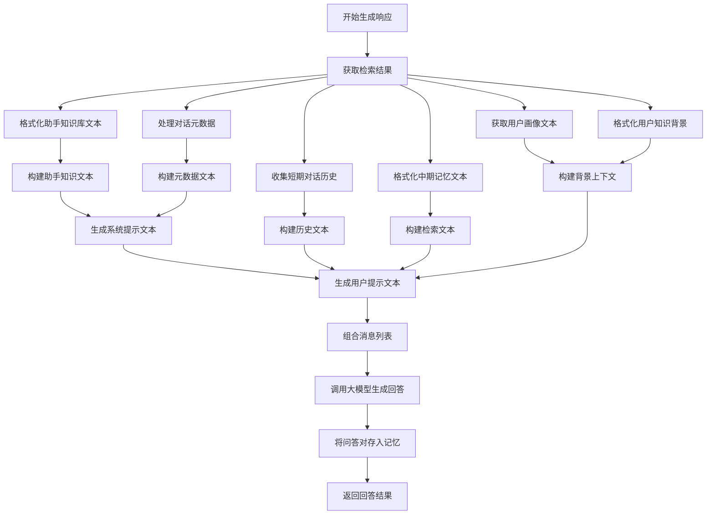
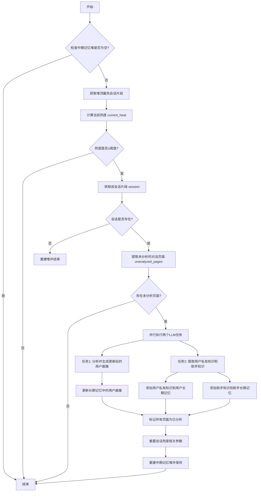

`memoryos-pypi/retriever.py`文件实现了 Retriever 类，用于从多维度记忆系统（中期记忆、用户长期记忆、助手长期记忆）中并行检索与用户查询相关的上下文信息，为生成响应提供数据支持。
核心功能:通过并行任务从三个记忆模块中检索相关信息，整合后返回结构化结果，供后续生成回答使用。

除了短期记忆是直接获取，其他都是需要向量匹配的，向量匹配就需要调用各自记忆的search方法。在`retrieve_context`中调用并获取结果。
```python
# from memoryos.py
def get_response(self, query: str, relationship_with_user="friend", style_hint="", user_conversation_meta_data: dict = None) -> str:
    """
    Generates a response to the user's query, incorporating memory and context.
    """
    print(f"Memoryos: Generating response for query: '{query[:50]}...'")

    # 1. Retrieve context
    retrieval_results = self.retriever.retrieve_context(
        user_query=query,
        user_id=self.user_id
        # Using default thresholds from Retriever class for now
    )
    retrieved_pages = retrieval_results["retrieved_pages"]
    retrieved_user_knowledge = retrieval_results["retrieved_user_knowledge"]
    retrieved_assistant_knowledge = retrieval_results["retrieved_assistant_knowledge"]

    # 2. Get short-term history
    short_term_history = self.short_term_memory.get_all()
    history_text = "\n".join([
        f"User: {qa.get('user_input', '')}\nAssistant: {qa.get('agent_response', '')} (Time: {qa.get('timestamp', '')})"
        for qa in short_term_history
    ])

    # 3. Format retrieved mid-term pages (retrieval_queue equivalent)
    retrieval_text = "\n".join([
        f"【Historical Memory】\nUser: {page.get('user_input', '')}\nAssistant: {page.get('agent_response', '')}\nTime: {page.get('timestamp', '')}\nConversation chain overview: {page.get('meta_info','N/A')}"
        for page in retrieved_pages
    ])

    # 4. Get user profile
    user_profile_text = self.user_long_term_memory.get_raw_user_profile(self.user_id)
    if not user_profile_text or user_profile_text.lower() == "none": 
        user_profile_text = "No detailed profile available yet."

    # 5. Format retrieved user knowledge for background
    user_knowledge_background = ""
    if retrieved_user_knowledge:
        user_knowledge_background = "\n【Relevant User Knowledge Entries】\n"
        for kn_entry in retrieved_user_knowledge:
            user_knowledge_background += f"- {kn_entry['knowledge']} (Recorded: {kn_entry['timestamp']})\n"
    
    background_context = f"【User Profile】\n{user_profile_text}\n{user_knowledge_background}"

    # 6. Format retrieved Assistant Knowledge (from assistant's LTM)
    # Use retrieved assistant knowledge instead of all assistant knowledge
    assistant_knowledge_text_for_prompt = "【Assistant Knowledge Base】\n"
    if retrieved_assistant_knowledge:
        for ak_entry in retrieved_assistant_knowledge:
            assistant_knowledge_text_for_prompt += f"- {ak_entry['knowledge']} (Recorded: {ak_entry['timestamp']})\n"
    else:
        assistant_knowledge_text_for_prompt += "- No relevant assistant knowledge found for this query.\n"

    # 7. Format user_conversation_meta_data (if provided)
    meta_data_text_for_prompt = "【Current Conversation Metadata】\n"
    if user_conversation_meta_data:
        try:
            meta_data_text_for_prompt += json.dumps(user_conversation_meta_data, ensure_ascii=False, indent=2)
        except TypeError:
            meta_data_text_for_prompt += str(user_conversation_meta_data)
    else:
        meta_data_text_for_prompt += "None provided for this turn."

    # 8. Construct Prompts
    system_prompt_text = prompts.GENERATE_SYSTEM_RESPONSE_SYSTEM_PROMPT.format(
        relationship=relationship_with_user,
        assistant_knowledge_text=assistant_knowledge_text_for_prompt,
        meta_data_text=meta_data_text_for_prompt # Using meta_data_text placeholder for user_conversation_meta_data
    )
    
    user_prompt_text = prompts.GENERATE_SYSTEM_RESPONSE_USER_PROMPT.format(
        history_text=history_text,
        retrieval_text=retrieval_text,
        background=background_context,
        relationship=relationship_with_user,
        query=query
    )
    
    messages = [
        {"role": "system", "content": system_prompt_text},
        {"role": "user", "content": user_prompt_text}
    ]

    # 9. Call LLM for response
    print("Memoryos: Calling LLM for final response generation...")
    # print("System Prompt:\n", system_prompt_text)
    # print("User Prompt:\n", user_prompt_text)
    response_content = self.client.chat_completion(
        model=self.llm_model, 
        messages=messages, 
        temperature=0.7, 
        max_tokens=1500 # As in original main
    )
    
    # 10. Add this interaction to memory
    self.add_memory(user_input=query, agent_response=response_content, timestamp=get_timestamp())
    
    return response_content
```

## short-term memory
本身结构是QA对的列表形式，用固定容量队列维护
```python
# short memory的QA对形式，用列表形式存储在本地JSON文件或者ChromaDB
{
    "user_input": "你好，我喜欢科幻电影",
    "agent_response": "我知道了，你喜欢科幻类型的电影。",
    "timestamp": "2024-10-01T10:30:00"
}
self.memory = deque(maxlen=max_capacity)
```
检索时返回队列中的所有元素
```python
# from short_term.py
def get_all(self):
        return list(self.memory)
```
解析后形成history_text，后加入GENERATE_SYSTEM_RESPONSE_USER_PROMPT，形成user_prompt_text。
## retriever的组成
```python
self.mid_term_memory = mid_term_memory
self.long_term_memory = long_term_memory
self.assistant_long_term_memory = assistant_long_term_memory # Store assistant LTM reference
self.retrieval_queue_capacity = queue_capacity
```
其中有**long_term_memory**（代表用户长期记忆）、**assistant_long_term_memory**（代表助手长期记忆），都是long_term_memory的**knowledge base**结构。


## `retrieve_context`（主入口）
作用：触发并行检索任务，整合结果并返回。
返回结构:
```python
{
    "retrieved_pages": 中期记忆中的相关页面列表,
    "retrieved_user_knowledge": 用户长期知识中的相关条目列表,
    "retrieved_assistant_knowledge": 助手长期知识中的相关条目列表,
    "retrieved_at": 检索时间戳
}
```
**retrieved_user_knowledge**（用户私有知识）
定义：从用户长期记忆中检索到的碎片化、事实性的用户信息（如用户提到的经历、偏好细节、个人数据等）。
来源：通过Retriever的_retrieve_user_knowledge方法，调用long_term_memory.search_user_knowledge方法，根据当前查询与用户**长期知识库**中的条目进行相似度匹配，返回最相关的结果（过滤掉低于阈值的条目）。
**retrieved_assistant_knowledge**（助手知识库）
定义：从助手长期记忆中检索到的与当前查询相关的助手自身知识（如助手之前提供的信息、规则、技能等）。
来源：通过Retriever的_retrieve_assistant_knowledge方法，从助手专属的长期知识库中匹配与查询相关的条目。

## `_retrieve_mid_term_context`（中期记忆检索）
从中期记忆中检索与用户查询相关的会话页面，通过语义相似度筛选和优先级排序，提取最相关的前 N 个页面（N 由 retrieval_queue_capacity 控制），为生成响应提供上下文支持。
### mid-term memory
中期记忆的会话结构（来自 mid_term.py）
- 中期记忆存在两层嵌入：会话摘要嵌入（summary_embedding）和页面内容嵌入（page_embedding），用于多级语义检索。
- 额外维护会话 / 页面的关联关系（pre_page/next_page）、访问频率、热度（H_segment）等元数据，支持动态更新和淘汰策略（如 LFU 淘汰）。
```python
session_obj = {
    "id": session_id,
    "summary": summary,
    "summary_keywords": summary_keywords,
    "summary_embedding": summary_vec,
    "details": processed_details,
    "L_interaction": len(processed_details),
    "R_recency": 1.0, # Initial recency
    "N_visit": 0,
    "H_segment": 0.0, # Initial heat, will be computed
    "timestamp": current_ts, # Creation timestamp
    "last_visit_time": current_ts, # Also initial last_visit_time for recency calc
    "access_count_lfu": 0 # For LFU eviction policy
}
processed_page = {
    **page_data, # Carry over existing fields like user_input, agent_response, timestamp
    "page_id": page_id,
    "page_embedding": inp_vec,
    "page_keywords": page_keywords,
    "preloaded": page_data.get("preloaded", False), # Preserve if passed
    "analyzed": page_data.get("analyzed", False),   # Preserve if passed
    # pre_page, next_page, meta_info are handled by DynamicUpdater
}
```
检索时根据用户查询文本，从中期记忆中**检索相关的会话（session）及其中的对话页面（page）**，并返回匹配结果。
```python
def search_sessions(self, query_text, segment_similarity_threshold=0.1, page_similarity_threshold=0.1, 
                        top_k_sessions=5, keyword_alpha=1.0, recency_tau_search=3600):
    if not self.sessions:
        return []

    # 生成query向量归一化
    query_vec = get_embedding(
        query_text,
        model_name=self.embedding_model_name,
        **self.embedding_model_kwargs
    )
    query_vec = normalize_vector(query_vec) # L2 归一化的原理是将向量除以其 L2 范数（即向量的模长）
    query_keywords = set()  # Keywords extraction removed, relying on semantic similarity

    # 遍历所有存储的会话，计算每个会话的摘要向量与查询向量的寓意相似度（cosine）
    candidate_sessions = []
    session_ids = list(self.sessions.keys())
    if not session_ids: return []

    summary_embeddings_list = [self.sessions[s]["summary_embedding"] for s in session_ids]
    summary_embeddings_np = np.array(summary_embeddings_list, dtype=np.float32)

    dim = summary_embeddings_np.shape[1]
    index = faiss.IndexFlatIP(dim) # 计算向量之间的内积（Inner Product），但在向量经过归一化的前提下，内积结果与余弦相似度是等价的。
    index.add(summary_embeddings_np)

    # 根据语义选取top_k_sessions，若会话总数少于 top_k_sessions，则取全部
    query_arr_np = np.array([query_vec], dtype=np.float32)
    distances, indices = index.search(query_arr_np, min(top_k_sessions, len(session_ids)))

    results = []
    current_time_str = get_timestamp()

    # 基于 FAISS 索引返回的会话相似度结果，结合关键词匹配和页面级语义相似度筛选，提取与用户查询相关的会话及页面，并更新会话的访问属性（如热度、访问次数）。
    for i, idx in enumerate(indices[0]): # indices[0] 是 FAISS 检索返回的 Top K 会话索引列表（按相似度降序排列）。
        if idx == -1: continue # 跳过无效索引（idx == -1），避免处理不存在的会话。
        
        session_id = session_ids[idx]
        session = self.sessions[session_id]
        semantic_sim_score = float(distances[0][i]) # 会话摘要与查询的语义相似度（归一化向量的内积，等价于余弦相似度）

        # 计算会话关键词相似度
        session_keywords = set(session.get("summary_keywords", [])) # 会话摘要的关键词集合
        s_topic_keywords = 0  # 关键词重叠度（0~1）
        if query_keywords and session_keywords:
            # 计算查询关键词与会话关键词的 Jaccard 指数（交集/并集）
            intersection = len(query_keywords.intersection(session_keywords))
            union = len(query_keywords.union(session_keywords))
            if union > 0: s_topic_keywords = intersection / union
        
        # Time decay for session recency in search scoring
        # time_decay_factor = compute_time_decay(session["timestamp"], current_time_str, tau_hours=recency_tau_search)
        
        # 计算会话综合相关性得分，综合语义相似度和关键词相似度（可通过 keyword_alpha 调整关键词权重）
        session_relevance_score =  (semantic_sim_score + keyword_alpha * s_topic_keywords)
        # 会话级筛选，计算页面内容向量与查询向量的语义相似度
        # 对会话内的每个页面，通过向量内积计算与查询的语义相似度，筛选出得分高于 page_similarity_threshold 的页面。
        if session_relevance_score >= segment_similarity_threshold:
            matched_pages_in_session = []
            for page in session.get("details", []):
                page_embedding = np.array(page["page_embedding"], dtype=np.float32)
                # page_keywords = set(page.get("page_keywords", []))
                
                page_sim_score = float(np.dot(page_embedding, query_vec))
                # Can also add keyword sim for pages if needed, but keeping it simpler for now

                if page_sim_score >= page_similarity_threshold:  # 页面级筛选
                    matched_pages_in_session.append({"page_data": page, "score": page_sim_score})
            
            # 更新会话属性并记录结果
            if matched_pages_in_session:
                # Update session access stats
                session["N_visit"] += 1  # 访问次数+1
                session["last_visit_time"] = current_time_str  # 更新最后访问时间
                session["access_count_lfu"] += 1  # LFU 淘汰计数+1
                self.access_frequency[session_id] = session["access_count_lfu"]  # 同步到访问频率字典
                session["H_segment"] = compute_segment_heat(session)  # 重新计算会话热度
                self.rebuild_heap()  # 因热度变化，重建堆结构（用于后续淘汰）
                
                results.append({ # 将结果加入返回列表（页面按相似度降序排序）
                    "session_id": session_id,
                    "session_summary": session["summary"],
                    "session_relevance_score": session_relevance_score,
                    "matched_pages": sorted(matched_pages_in_session, key=lambda x: x["score"], reverse=True) # Sort pages by score
                })
    
    self.save() # Save changes from access updates
    # Sort final results by session_relevance_score
    return sorted(results, key=lambda x: x["session_relevance_score"], reverse=True)
```
> 在代码中，`faiss.IndexFlatIP(dim)` 确实用于计算向量之间的**内积（Inner Product）**，但在向量经过归一化的前提下，内积结果与余弦相似度是**等价的**。以下是具体说明：
1. **向量归一化的前提**
在 MemoryOS 的实现中，所有向量（查询向量、会话摘要向量、页面内容向量等）都会经过 `normalize_vector` 处理，即转换为**单位向量**（向量的 L2 范数为 1）。
归一化的核心作用是：对于两个单位向量，它们的**内积结果等于余弦相似度**。  
数学上，若向量 `a` 和 `b` 均为单位向量，则：  
`cosine_similarity(a, b) = (a · b) / (||a|| · ||b||) = a · b`（因 `||a|| = ||b|| = 1`）。
2. **FAISS 中的 IndexFlatIP 与余弦相似度**
`faiss.IndexFlatIP(dim)` 用于高效计算向量之间的内积。
由于代码中所有向量都经过归一化（单位向量），此时内积的结果**直接等价于余弦相似度**，因此本质上仍是在计算语义相似度。
3. **代码中的验证**
在提供的代码片段中，多处明确对向量进行归一化：
中期记忆的 `add_session` 方法中，对 `summary_vec` 和页面的 `inp_vec` 调用 `normalize_vector`。
长期记忆的 `_search_knowledge_deque` 方法中，对查询向量 `query_vec` 调用 `normalize_vector`。
因此，尽管 FAISS 调用的是内积计算，但在归一化的前提下，其结果与余弦相似度完全一致，最终实现的仍是**语义相似度匹配**。
【结论】代码中通过 `faiss.IndexFlatIP` 计算的内积，在向量归一化的前提下，**等价于余弦相似度**，目的是准确衡量查询与会话 / 知识之间的语义相关性。

> **LFU**（Least Frequently Used Frequently Used，最不经常使用），核心思想：优先淘汰在最近一段时间内被访问次数最少的页面。

```python
# from retriever.py
def _retrieve_mid_term_context(self, user_query, segment_similarity_threshold, page_similarity_threshold, top_k_sessions):
    """并行任务：从中期记忆检索"""
    print("Retriever: Searching mid-term memory...")
    # 调用 mid_term_memory.search_sessions 方法，根据查询文本和相似度阈值（segment_similarity_threshold、page_similarity_threshold）获取匹配的会话。
    matched_sessions = self.mid_term_memory.search_sessions(
        query_text=user_query, 
        segment_similarity_threshold=segment_similarity_threshold,
        page_similarity_threshold=page_similarity_threshold,
        top_k_sessions=top_k_sessions
    )
    
    # 使用小顶堆（heapq）筛选分数最高的页面（在限制容量的情况下，最后留下的就是分数最高的）
    top_pages_heap = []
    page_counter = 0  # 确保堆中元素的唯一性（避免排序冲突）
    for session_match in matched_sessions:
        for page_match in session_match.get("matched_pages", []):
            page_data = page_match["page_data"]
            page_score = page_match["score"] # Using the page score directly
            
            # 目前 combined_score 直接使用页面自身的相似度得分，可扩展为结合会话级得分（如 page_score * session_relevance_score）以优化排序。
            combined_score = page_score # Potentially adjust with session_relevance_score

            # 若堆未满，直接加入；若堆已满，替换分数最低的页面。
            if len(top_pages_heap) < self.retrieval_queue_capacity:
                heapq.heappush(top_pages_heap, (combined_score, page_counter, page_data))
                page_counter += 1
            elif combined_score > top_pages_heap[0][0]: # If current page is better than the worst in heap
                heapq.heappop(top_pages_heap)
                heapq.heappush(top_pages_heap, (combined_score, page_counter, page_data))
                page_counter += 1
    
    # 堆中元素默认按得分升序排列（小顶堆特性），通过 sorted 函数按得分降序重新排序，确保返回结果从最相关到次相关。
    retrieved_pages = [item[2] for item in sorted(top_pages_heap, key=lambda x: x[0], reverse=True)]
    print(f"Retriever: Mid-term memory recalled {len(retrieved_pages)} pages.")
    return retrieved_pages
```
## long-term memory
1. **knowledge base**
队列中每个元素的结构,用最大容量的队列维护。
队列的核心作用是限制知识总量（通过 maxlen），超出容量时自动淘汰最旧的知识。
仅维护与知识直接相关的嵌入（knowledge_embedding），无会话或页面层级的划分。
```python
# from long_term.py
entry = {
    "knowledge": "知识文本内容",
    "timestamp": "存储时间戳",
    "knowledge_embedding": [0.123, 0.456, ...]  # 知识的语义嵌入向量
}
# 长期记忆中存储知识的队列（来自 long_term.py）
self.knowledge_base = deque(maxlen=self.knowledge_capacity)  # 用户私有知识
```
2. **user profiles**
用户画像的存储结构：user_id对应单一data文本，更新时要么合并到现有文本，要么直接替换。
```python
self.user_profiles = {
    "user_id": {
        "data": "用户画像文本内容（单一字符串）",
        "last_updated": "时间戳"
    }
}
self.assistant_knowledge = deque(maxlen=self.knowledge_capacity)  # 助手专属知识
```
不同模块中update_user_profile方法的逻辑存在细节差异，主要体现在合并策略和参数设计上：
`eval/long_term_memory.py`中的更新逻辑:merge参数默认为False（默认直接替换），合并时仅简单拼接文本（带分隔符）。
```python
def update_user_profile(self, user_id, new_data, merge=False):
    if merge and user_id in self.user_profiles:
        current_data = self.user_profiles[user_id]["data"]
        if isinstance(current_data, str) and isinstance(new_data, str):
            # 合并：保留原有数据，追加新数据（带分隔符）
            updated_data = f"{current_data}\n\n--- Updated ---\n{new_data}"
        else:
            updated_data = new_data  # 非字符串格式直接覆盖
    else:
        updated_data = new_data  # 不合并时直接替换
    self.user_profiles[user_id] = {"data": updated_data, "last_updated": get_timestamp()}
```
`memoryos-pypi/long_term.py`和`memoryos-mcp/memoryos/long_term.py`中的更新逻辑:merge参数默认为True（默认合并），合并时拼接文本并添加更新时间戳，更强调时序性。
```python
def update_user_profile(self, user_id, new_data, merge=True):
    if merge and user_id in self.user_profiles and self.user_profiles[user_id].get("data"):
        current_data = self.user_profiles[user_id]["data"]
        if isinstance(current_data, str) and isinstance(new_data, str):
            # 合并：保留原有数据，追加新数据（带时间戳分隔符）
            updated_data = f"{current_data}\n\n--- Updated on {get_timestamp()} ---\n{new_data}"
        else:
            updated_data = new_data  # 非字符串格式直接覆盖
    else:
        updated_data = new_data  # 不合并时直接替换
    self.user_profiles[user_id] = {"data": updated_data, "last_updated": get_timestamp()}
```
`memoryos-chromadb/storage_provider.py`中的更新逻辑:无合并逻辑，直接用新的profile_data（字典）覆盖旧数据，且profile_data的结构更灵活（未限定data字段必须为字符串）。
```python
def update_user_profile(self, user_id: str, profile_data: Dict[str, Any]):
    self.metadata.setdefault("user_profiles", {})[user_id] = profile_data
```
存储结构一致性：所有模块中，**user_id均对应单一data文本**（非列表），画像以整体文本形式存储。
核心目标一致：均通过user_id定位用户，通过覆盖或合并更新其唯一的画像文本，确保画像的连续性和完整性。


### knowledge base的检索： `_retrieve_user_knowledge`
作用：从用户长期记忆中检索相关知识条目。
流程：调用 long_term_memory.search_user_knowledge 方法，根据查询文本、阈值（knowledge_threshold）和返回数量（top_k_knowledge）获取相关知识。进而调用search_knowledge_deque函数，返回检索到的用户知识条目列表。
```python
# from retriever.py
def _retrieve_user_knowledge(self, user_query, knowledge_threshold, top_k_knowledge):
    """并行任务：从用户长期知识检索"""
    print("Retriever: Searching user long-term knowledge...")
    retrieved_knowledge = self.long_term_memory.search_user_knowledge(
        user_query, threshold=knowledge_threshold, top_k=top_k_knowledge
    )
    print(f"Retriever: Long-term user knowledge recalled {len(retrieved_knowledge)} items.")
    return retrieved_knowledge
```
`_search_knowledge_deque` 是 LongTermMemory 类中用于从知识队列（deque）中检索与查询相关知识的核心方法，通过语义向量匹配实现高效的知识筛选。
知识队列长期记忆的检索仅基于知识嵌入（knowledge_embedding），通过向量相似度匹配直接从队列中筛选结果。
```python
# from long_term.py
def _search_knowledge_deque(self, query, knowledge_deque: deque, threshold=0.1, top_k=5):
    if not knowledge_deque:
        return []
    
    # 生成查询向量（同上）
    query_vec = get_embedding(...)
    query_vec = normalize_vector(query_vec)
    
    # 
    embeddings = []
    valid_entries = []
    for entry in knowledge_deque:
        if "knowledge_embedding" in entry and entry["knowledge_embedding"]:
            embeddings.append(np.array(entry["knowledge_embedding"], dtype=np.float32))
            valid_entries.append(entry)
        else:
            print(f"Warning: Entry without embedding found in knowledge_deque: {entry.get('knowledge','N/A')[:50]}")

    if not embeddings:
        return []
        
    embeddings_np = np.array(embeddings, dtype=np.float32)
    if embeddings_np.ndim == 1: # Single item case
        if embeddings_np.shape[0] == 0: return [] # Empty embeddings
        embeddings_np = embeddings_np.reshape(1, -1)
    
    if embeddings_np.shape[0] == 0: # No valid embeddings
        return []

    dim = embeddings_np.shape[1]
    index = faiss.IndexFlatIP(dim) # Using Inner Product for similarity
    index.add(embeddings_np)
    
    query_arr = np.array([query_vec], dtype=np.float32)
    distances, indices = index.search(query_arr, min(top_k, len(valid_entries))) # Search at most k or length of valid_entries
    
    results = []
    for i, idx in enumerate(indices[0]):
        if idx != -1: # faiss returns -1 for no valid index
            similarity_score = float(distances[0][i]) # For IndexFlatIP, distance is the dot product (similarity)
            if similarity_score >= threshold:
                results.append(valid_entries[idx]) # Add the original entry dict
    
    # Sort by similarity score descending before returning, as faiss might not guarantee order for IP
    results.sort(key=lambda x: float(np.dot(np.array(x["knowledge_embedding"], dtype=np.float32), query_vec)), reverse=True)
    return results
```
> 【总结】长期记忆的设计目标是存储结构化的知识条目，仅通过队列维护知识文本及其嵌入向量（knowledge_embedding），结构简单且聚焦于知识本身；而中期记忆则是存储会话交互历史，通过会话 - 页面的层级结构维护更细粒度的交互内容，并附加大量元数据用于动态管理和检索。两者在数据结构、嵌入粒度和检索逻辑上均无重叠，长期记忆中确实不存在中期记忆的 “会话（session）” 和 “页面（page）” 概念。

### 用户画像 `get_raw_user_profile`
定义：对用户的整体性、总结性描述，整合了用户的性格、核心偏好、背景等宏观特征。。
来源：通过LongTermMemory的`get_raw_user_profile`方法获取，由`gpt_user_profile_analysis`定期分析对话历史生成（如`_trigger_profile_and_knowledge_update_if_needed`中触发），是对用户长期行为和信息的抽象概括。

1. `_trigger_profile_and_knowledge_update_if_needed`
在 _trigger_profile_and_knowledge_update_if_needed 方法监控中期记忆中会话片段的 “热度”（H_segment），判断是否需要更新用户画像和知识。当热度超过阈值时，对未分析的对话内容进行处理，提取用户私有知识和助手知识，更新长期记忆。处理完成后重置会话热度，避免重复分析。

```python
# from memoryos-pypi/memoryos.py
def _trigger_profile_and_knowledge_update_if_needed(self):
    """
    Checks mid-term memory for hot segments and triggers profile/knowledge update if threshold is met.
    Adapted from main_memoybank.py's update_user_profile_from_top_segment.
    Enhanced with parallel LLM processing for better performance.
    """
    if not self.mid_term_memory.heap:
        return

    # 检查中期记忆中热度最高的会话段,使用堆（heap）存储会话片段，堆中元素为 (-H_segment, sid)（负热度用于实现最小堆，堆顶为最热片段）。
    neg_heat, sid = self.mid_term_memory.heap[0] 
    current_heat = -neg_heat

    if current_heat >= self.mid_term_heat_threshold:
        session = self.mid_term_memory.sessions.get(sid)
        if not session: 
            # 会话已被淘汰（LFU 策略触发），中期记忆（MidTermMemory）采用 LFU（最近最少使用）淘汰策略。当会话数量超过 max_capacity 时，会删除访问频率最低的会话（evict_lfu 方法）。
            # 堆（heap）存储的是 (-H_segment, sid)，用于快速定位最热会话，但堆的更新依赖 rebuild_heap 方法。若某些操作未及时触发堆重建，会导致堆中保留已删除的 sid。
            # ... 多种异常情况，进行自我修复，重建堆
            self.mid_term_memory.rebuild_heap()
            return

        # # 获取该会话中未分析的页面（对话内容）
        # A page is a dict: {"user_input": ..., "agent_response": ..., "timestamp": ..., "analyzed": False, ...}
        unanalyzed_pages = [p for p in session.get("details", []) if not p.get("analyzed", False)]

        if unanalyzed_pages:
            print(f"Memoryos: Mid-term session {sid} heat ({current_heat:.2f}) exceeded threshold. Analyzing {len(unanalyzed_pages)} pages for profile/knowledge update.")
            
            # 并行执行两个LLM任务：用户画像分析（已包含更新）、知识提取
            def task_user_profile_analysis():
                print("Memoryos: Starting parallel user profile analysis and update...")
                # 获取现有用户画像
                existing_profile = self.user_long_term_memory.get_raw_user_profile(self.user_id)
                if not existing_profile or existing_profile.lower() == "none":
                    existing_profile = "No existing profile data."
                
                # 直接输出更新后的完整画像
                return gpt_user_profile_analysis(unanalyzed_pages, self.client, model=self.llm_model, existing_user_profile=existing_profile)
            
            def task_knowledge_extraction():
                print("Memoryos: Starting parallel knowledge extraction...")
                return gpt_knowledge_extraction(unanalyzed_pages, self.client, model=self.llm_model)
            
            # 使用并行任务执行                
            with ThreadPoolExecutor(max_workers=2) as executor:
                # 提交两个主要任务
                future_profile = executor.submit(task_user_profile_analysis)
                future_knowledge = executor.submit(task_knowledge_extraction)
                
                # 等待结果
                try:
                    updated_user_profile = future_profile.result()  # 直接是更新后的完整画像
                    knowledge_result = future_knowledge.result()
                except Exception as e:
                    print(f"Error in parallel LLM processing: {e}")
                    return
            
            new_user_private_knowledge = knowledge_result.get("private")
            new_assistant_knowledge = knowledge_result.get("assistant_knowledge")

            # 更新完整用户画像
            if updated_user_profile and updated_user_profile.lower() != "none":
                print("Memoryos: Updating user profile with integrated analysis...")
                self.user_long_term_memory.update_user_profile(self.user_id, updated_user_profile, merge=False)  # 直接替换为新的完整画像
            
            # 更新用户私有信息
            if new_user_private_knowledge and new_user_private_knowledge.lower() != "none":
                for line in new_user_private_knowledge.split('\n'):
                        if line.strip() and line.strip().lower() not in ["none", "- none", "- none."]:
                        self.user_long_term_memory.add_user_knowledge(line.strip())

            # 更新用户助手信息
            if new_assistant_knowledge and new_assistant_knowledge.lower() != "none":
                for line in new_assistant_knowledge.split('\n'):
                    if line.strip() and line.strip().lower() not in ["none", "- none", "- none."]:
                        self.assistant_long_term_memory.add_assistant_knowledge(line.strip()) # Save to dedicated assistant LTM

            # 当会话热度超过阈值并完成分析后，若不重置这些参数，其热度可能仍保持在高位，导致后续再次触发相同内容的分析，造成资源浪费（如重复调用 LLM）。
            # 重置 N_visit = 0 和 L_interaction = 0 会显著降低会话的热度（H_segment），使其暂时退出 “待分析” 状态。
            for p in session["details"]:
                p["analyzed"] = True # Mark all pages in session, or just unanalyzed_pages?
                                        # Original code marked all pages in session
            
            session["N_visit"] = 0 # Reset visits after analysis
            session["L_interaction"] = 0 # Reset interaction length contribution
            # session["R_recency"] = 1.0 # Recency will re-calculate naturally
            session["H_segment"] = compute_segment_heat(session) # Recompute heat with reset factors
            session["last_visit_time"] = get_timestamp() # Update last visit time
            
            self.mid_term_memory.rebuild_heap() # Heap needs rebuild due to H_segment change
            self.mid_term_memory.save()
            print(f"Memoryos: Profile/Knowledge update for session {sid} complete. Heat reset.")
        else:
            print(f"Memoryos: Hot session {sid} has no unanalyzed pages. Skipping profile update.")
    else:
        # print(f"Memoryos: Top session {sid} heat ({current_heat:.2f}) below threshold. No profile update.")
        pass # No action if below threshold
```
在 _trigger_profile_and_knowledge_update_if_needed 函数中，处理完热度超标的会话后重置 session 的频率（N_visit）、交互长度（L_interaction）等参数，主要是为了避免重复分析同一批对话内容，并确保中期记忆的热度计算机制能准确反映新的交互情况。具体原因如下：
1. 避免重复触发更新
会话的热度（H_segment）是基于 N_visit（访问次数）、L_interaction（交互长度）、R_recency（时效性）等参数计算的（通过 compute_segment_heat 函数）。
当会话热度超过阈值并完成分析后，若不重置这些参数，其热度可能仍保持在高位，导致后续再次触发相同内容的分析，造成资源浪费（如重复调用 LLM）。
重置 N_visit = 0 和 L_interaction = 0 会显著降低会话的热度（H_segment），使其暂时退出 “待分析” 状态。
2. 确保热度机制的动态性
中期记忆的核心作用是跟踪近期高频或重要的对话片段。热度参数需要随时间和新交互动态变化，才能准确反映会话的当前重要性。
例如：
N_visit 记录会话被检索的次数，重置后可重新累计新的访问，避免旧数据干扰。
L_interaction 反映会话包含的交互页数，重置后可基于新添加的页面积累长度，确保热度与最新内容挂钩。
重置后，会话的热度会根据后续新的交互（如用户继续提问、会话被再次检索）重新计算，实现 “热度动态衰减与回升” 的机制。
3. 标记会话状态已更新
函数会将会话中所有页面标记为 analyzed: True，表明这些内容已被用于更新用户画像和知识。
同步重置 N_visit、L_interaction 并重新计算 H_segment，是对 “会话状态已更新” 的补充，确保系统不会将已分析的内容再次纳入处理流程。
4. 维持中期记忆的容量平衡
中期记忆有最大容量限制（max_capacity），并通过 LFU（最近最少使用）策略淘汰低价值会话。
重置参数后，会话的热度暂时降低，避免长期占据 “高热度” 位置，为新的重要会话腾出空间，保证中期记忆的高效利用。
【总结】重置操作是中期记忆 “热度触发机制” 的重要一环，其核心目标是：
防止重复分析已处理的内容，节省计算资源；
让热度参数准确反映会话的最新状态，确保重要的新交互能被及时捕捉；
维持中期记忆的动态平衡，提升整体记忆系统的有效性。
    
```python
# from memoryos-pypi\utils.py

# 用户私有数据：用户的个人信息、偏好、经历等私有信息（如 “用户喜欢科幻电影”）。
# 助手知识：助手在回复中提供的通用信息、规则或常识（如 “Python 是一种编程语言”）。
def gpt_knowledge_extraction(dialogs, client: OpenAIClient, model="gpt-4o-mini"):
    """Extract user private data and assistant knowledge from dialogs"""
    # 格式化对话内容，构造 LLM 提示词
    conversation = "\n".join([f"User: {d.get('user_input','')} (Timestamp: {d.get('timestamp', '')})\nAssistant: {d.get('agent_response','')} (Timestamp: {d.get('timestamp', '')})" for d in dialogs])
    messages = [
        {"role": "system", "content": prompts.KNOWLEDGE_EXTRACTION_SYSTEM_PROMPT},
        {"role": "user", "content": prompts.KNOWLEDGE_EXTRACTION_USER_PROMPT.format(
            conversation=conversation
        )}
    ]
    
    # 调用 LLM 并解析结果，通过字符串匹配解析出两类信息
    # 解析逻辑：通过【User Private Data】和【Assistant Knowledge】标签定位内容，支持三种场景：仅用户数据、仅助手知识、两者都有。
    print("Calling LLM for knowledge extraction...")
    result_text = client.chat_completion(model=model, messages=messages)
    
    private_data = "None"
    assistant_knowledge = "None"

    try:
        if "【User Private Data】" in result_text:
            private_data_start = result_text.find("【User Private Data】") + len("【User Private Data】")
            if "【Assistant Knowledge】" in result_text:
                private_data_end = result_text.find("【Assistant Knowledge】")
                private_data = result_text[private_data_start:private_data_end].strip()
                
                assistant_knowledge_start = result_text.find("【Assistant Knowledge】") + len("【Assistant Knowledge】")
                assistant_knowledge = result_text[assistant_knowledge_start:].strip()
            else:
                private_data = result_text[private_data_start:].strip()
        elif "【Assistant Knowledge】" in result_text:
             assistant_knowledge_start = result_text.find("【Assistant Knowledge】") + len("【Assistant Knowledge】")
             assistant_knowledge = result_text[assistant_knowledge_start:].strip()

    except Exception as e:
        print(f"Error parsing knowledge extraction: {e}. Raw result: {result_text}")

    # 以字典形式返回提取的信息，默认值为"None"（确保结果结构统一）：
    return {
        "private": private_data if private_data else "None", 
        "assistant_knowledge": assistant_knowledge if assistant_knowledge else "None"
    }

# from memoryos-pypi\utils.py
def gpt_user_profile_analysis(dialogs, client: OpenAIClient, model="gpt-4o-mini", existing_user_profile="None"):
    """
    Analyze and update user personality profile from dialogs
    结合现有画像和新对话，直接输出更新后的完整画像
    """
    conversation = "\n".join([f"User: {d.get('user_input','')} (Timestamp: {d.get('timestamp', '')})\nAssistant: {d.get('agent_response','')} (Timestamp: {d.get('timestamp', '')})" for d in dialogs])
    messages = [
        {"role": "system", "content": prompts.PERSONALITY_ANALYSIS_SYSTEM_PROMPT},
        {"role": "user", "content": prompts.PERSONALITY_ANALYSIS_USER_PROMPT.format(
            conversation=conversation,
            existing_user_profile=existing_user_profile
        )}
    ]
    print("Calling LLM for user profile analysis and update...")
    result_text = client.chat_completion(model=model, messages=messages)
    return result_text.strip() if result_text else "None"
```
KNOWLEDGE_EXTRACTION_SYSTEM_PROMPT，
> 你是一个知识提取助手。您的任务是从对话中提取用户私有数据和辅助知识。
关注:
> 1. 用户私有数据：关于用户的个人信息、偏好或私有事实
> 2. 辅助知识：关于助手做了什么、提供了什么或演示了什么的明确陈述
> 
> 在你的摘录中要极其简洁和真实。使用尽可能短的短语。

KNOWLEDGE_EXTRACTION_USER_PROMPT,
> 请从下面最新的用户与人工智能对话中提取用户私人数据和助手知识。
> 
> 最新的用户与ai对话：
{conversation}
> 
>【用户隐私数据】
提取用户的个人信息。尽量简洁——尽量使用最短的短语；
> -[简要事实]:[最小上下文（包括实体和时间）]
> -[简要事实]:[最小上下文（包括实体和时间）]
> -（如果没有找到私有数据，写“None”）
> 
> 【辅助知识】
提取助手演示的内容。使用格式“助手[动作]在[时间]”。极其简短：
> -在[时间/语境]时的助手[简短动作]
> -助手[简要能力]在[简要背景]
> -（如果没有找到辅助知识，写“None”）

PERSONALITY_ANALYSIS_SYSTEM_PROMPT，
> 你是专业的用户偏好分析助手。您的任务是根据提供的维度从给定的对话中分析用户的个性偏好。
> 对于每个维度：
> 1. 仔细阅读对话并确定维度是否得到了反映。
> 2. 如果反映出来，确定用户的偏好水平：高/中/低，并简要解释原因，包括时间、任务、内容，如果可能的话。
> 3. 如果没有反映维度，则不要提取或列出它。
> 在个性分析部分，只关注用户的偏好和特征。
>只输出用户配置文件部分。

PERSONALITY_ANALYSIS_USER_PROMPT,
> 请分析下面最新的用户- ai对话，并根据90个人格偏好维度更新用户资料。
> 以下是90个维度及其解释：
[心理模型（基本需求与个性）]
外向性：喜欢社交活动。
开放性：愿意接受新的想法和经验。
宜人性：倾向于友好和合作。
责任心：有责任心和组织能力。
神经质：情绪稳定和敏感。
生理需求：关心舒适和基本需求。
安全需求：强调安全稳定。
归属需求：对群体归属的渴望。
自尊需求：需要尊重和认可。
认知需求：对知识和理解的渴望。
审美欣赏：对美和艺术的欣赏。
自我实现：追求自己的全部潜能。
秩序需求：偏好清洁和组织。
自主性需求：偏好独立决策和行动。
权力需求：影响或控制他人的欲望。
成就需求：对成就的重视。
[AI对齐维度]
有用性：人工智能的响应是否对用户实际有用。（这反映了用户对AI的期望）
诚实：人工智能的反应是否真实。（这反映了用户对AI的期望）
安全性：避免敏感或有害成分。（这反映了用户对AI的期望）
指令遵从性：严格遵守用户指令。（这反映了用户对AI的期望）
真实性：内容的准确性和真实性。（这反映了用户对AI的期望）
连贯性：表达清晰、逻辑一致。（这反映了用户对AI的期望）
复杂性：偏爱详细和复杂的信息。
简洁：偏好简洁明了的回答。
[内容平台兴趣标签]
科学兴趣：对科学话题的兴趣。
教育兴趣：关心教育和学习。
心理学兴趣：对心理学话题感兴趣。
家庭关怀：对家庭和养育子女的兴趣。
时尚兴趣：对时尚话题感兴趣。
艺术兴趣：对艺术的参与或兴趣。
关注健康：关注身体健康和生活方式。
财务管理兴趣：对财务和预算有兴趣。
运动兴趣：对运动和体育活动的兴趣。
食物兴趣：热爱烹饪和烹饪。
旅游兴趣：对旅行和探索新地方的兴趣。
音乐兴趣：对音乐欣赏或创作的兴趣。
文学兴趣：对文学和阅读感兴趣。
电影兴趣：对电影和电影院的兴趣。
社交媒体活动：使用社交媒体的频率和参与度。
技术兴趣：对技术和创新的兴趣。
环境关注：关注环境和可持续性问题。
历史兴趣：对历史知识和主题的兴趣。
政治关注：对政治和社会问题感兴趣。
宗教兴趣：对宗教和灵性的兴趣。
游戏兴趣：电子游戏或桌面游戏的乐趣。
关心动物：关心动物或宠物。
情绪表达：偏好直接与克制的情绪表达。
幽默感：喜欢幽默或严肃的沟通方式。
信息密度：对详细信息和简明信息的偏好。
语言风格：对正式语气和休闲语气的偏好。
实用性：偏好实用建议vs.理论讨论。
**任务指令:**
> 1. 查看下面的现有用户配置文件
> 2. 分析新的对话，找出以上90个维度的证据
> 3. 更新调查结果并将其整合到一个全面的用户档案中
> 4. 对于每个可以识别的维度，使用以下格式：维度（级别（高/中/低））
> 5. 在可能的情况下，包括每个维度的简要推理
> 6. 在整合新的观察结果的同时，保持来自旧概况的现有见解
> 7. 如果一个维度不能从旧的概要文件或新的会话中推断出来，那么就不要包含它
> 
> **现有用户简介：**
{existing_user_profile}
**最新的用户- ai对话：**
{conversation}
**更新的用户配置文件：**
请提供以下全面更新的用户资料，结合现有资料和新对话的见解：

具体提示词内容见[提示词](../memoryos-pypi/prompts.py)

## 回复的提示词整合
GENERATE_SYSTEM_RESPONSE_SYSTEM_PROMPT，
> 作为一个有着杰出沟通习惯的沟通专家，你在接下来的对话中体现了{relationship}的作用。
这是你的一些独特的个人特征和知识：{assistant_knowledge_text}
用户画像：{meta_data_text} 
你的任务是做出符合这些特征的回应，并保持语气。

GENERATE_SYSTEM_RESPONSE_USER_PROMPT，
> <CONTEXT>根据你最近与用户的对话：{history_text}
<MEMORY>与正在进行的对话相关的记忆是：{retrieval_text}
<USER TRAITS>在过去您与用户的对话过程中，您发现该用户具有以下特征：{background}
现在，请扮演{relationship}，继续你和用户之间的对话。
用户刚才说：{query}
请使用以下格式回复用户的声明（最多30个单词，必须是英文）：
回答问题时，一定要检查所引用信息的时间戳是否与问题的时间范围相匹配

最后将query和回复作为新的QA追加到记忆：
`self.add_memory(user_input=query, agent_response=response_content, timestamp=get_timestamp())`
        