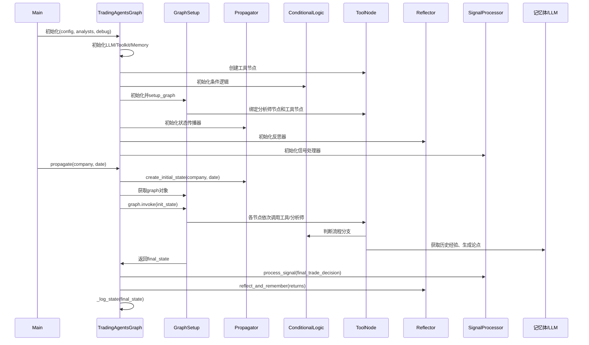
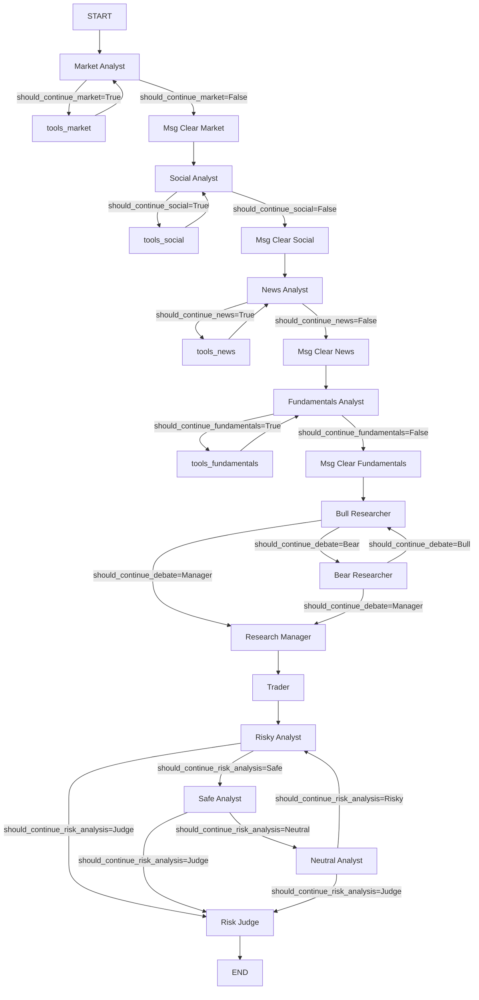

# TradingAgentsGraph 类详解
1. 初始化流程（__init__）
- 读取配置（config），设置项目目录。
- 初始化 LLM（支持 OpenAI、Anthropic、Google、DashScope 等）。
- 初始化工具箱（Toolkit），用于数据抓取和分析。
- 初始化记忆体（FinancialSituationMemory），用于存储和检索历史分析经验。
- 创建工具节点（ToolNode），每个节点对应一种数据源或分析方式。
- 初始化条件逻辑（ConditionalLogic），用于控制流程分支。
- 初始化图结构（GraphSetup），将各个分析节点和工具节点编织成完整的分析流程图。
- 初始化状态传播器（Propagator）、反思器（Reflector）、信号处理器（SignalProcessor）。
- 调用 setup_graph 方法，生成完整的 StateGraph。

2. 主要方法
- _create_tool_nodes()：创建各类工具节点，【预定义】为不同分析师提供可用工具，供分析流程调用。
> 返回一个字典，键为分析师类型，值为对应的 ToolNode 实例。每个 ToolNode 包含一组函数，这些函数来自 self.toolkit，用于获取不同类型的数据。例如：
>    - market 节点包含美股、A股等行情数据获取工具（如 Yahoo Finance、Stockstats、专用中国股票工具）。
>    - social 节点包含社交舆情相关工具（如 OpenAI 获取新闻、Reddit 舆情）。
>    - news 节点包含全球新闻、谷歌新闻、Finnhub 新闻等工具。
>    - fundamentals 节点包含公司基本面数据工具（如 OpenAI、通用中国股票工具、SimFin 财报等）。
- _log_state()：记录每次分析的完整状态到日志文件。
- process_signal()：处理最终信号，提取核心决策。
- propagate(company_name, trade_date)：在指定公司和交易日期下，运行交易智能体（agents）组成的图（graph），并返回最终的交易决策和处理后的信号。
>   1. 设置公司代码 `self.ticker = company_name`
>   2. 初始化状态: 通过 `self.propagator.create_initial_state(company_name, trade_date)` 创建初始智能体状态。
>   3. 获取运行智能体图所需的参数:`args = self.propagator.get_graph_args()`
>   4. 运行智能体图: 如果 self.debug 为真，进入调试模式，逐步追踪每个阶段的消息，并打印出来。否则，直接运行智能体图，得到最终状态。
>   5. 保存当前状态 `self.curr_state = final_state`,便于后续反思或分析。
>   6. 日志记录: 调用 `_log_state` 方法，将最终状态保存到本地 JSON 文件，便于后续复盘。
>   7. 返回最终状态和处理后的交易信号（如买入/卖出/观望等）。
- reflect_and_remember()：根据投资结果反思并更新记忆体。

3. 时序交互图（初始化到分析流程）

关键文件关联
- trading_graph.py: TradingAgentsGraph 主体
- setup.py: GraphSetup，负责搭建 StateGraph
- propagation.py: Propagator，负责状态初始化和传播
- conditional_logic.py: ConditionalLogic，流程分支判断
- signal_processing.py: SignalProcessor，信号处理
- reflection.py: Reflector，反思与记忆更新

## 关联目录：tradingagents/agents
### Toolkits类（utils/agent_utils.py）：定义各种 @staticmethod @tool

### FinancialSituationMemory类（utils/memory.py）

存储和检索金融情境与建议的记忆体类，核心功能是通过嵌入（embedding）技术实现语义相似度检索。它的设计让智能体能够“记住”历史情境及对应建议，并在新情境下快速查找最相关的经验。

1. 存储形式
- 底层存储：使用 ChromaDB 向量数据库，集合名为 name（如 bull_memory、bear_memory 等）。
- 数据结构：（每条记录包含：）
    - document：金融情境文本（如“高通胀+利率上升+消费下滑”）
    - metadata：建议文本（如“考虑防御型板块...”）
    - embedding：由 LLM 提供商生成的情境向量
    - id：唯一标识
- 嵌入生成：根据配置自动选择 OpenAI、DashScope 或其他兼容服务，调用对应 API 获得文本向量。

2. 交互方式
- 添加记忆（add_situations）
    - 输入：[(situation, recommendation,embedding,id), ...] 列表
    - 流程：对每个情境文本生成嵌入向量 -> 存入 ChromaDB 集合，附带建议和唯一 id
- 检索记忆（get_memories）
    - 输入：当前情境文本，返回最相似的 n 条建议
    - 流程：对当前情境生成嵌入向量 -> 在 ChromaDB 中做向量相似度检索，返回匹配度最高的历史情境、建议和相似度分数

### AgentState类（utils/agent_states.py）
作为整个交易流程中各个阶段的数据容器，记录和传递与交易相关的所有信息。它定义了交易流程中每一步所需的状态字段，包括公司信息、日期、各类分析报告、团队讨论状态、投资计划、风险评估等。

字段说明:
- company_of_interest 和 trade_date：记录当前关注的公司和交易日期。
sender：标记消息的发送者（哪个Agent）。
- 各类 *_report 字段：分别存储市场、社交媒体、新闻、基本面等分析师的报告。
- investment_debate_state：团队内部关于是否投资的讨论状态，类型为 InvestDebateState，包含多方观点和讨论历史。
- investment_plan 和 trader_investment_plan：分析师和交易员各自制定的投资计划。
- risk_debate_state：风险管理团队关于风险评估的讨论状态，类型为 RiskDebateState，包含不同风险偏好分析师的观点和讨论历史。
- final_trade_decision：风险分析师最终做出的交易决策。

结合 workflow = StateGraph(AgentState) 的作用:
StateGraph 是一个工作流管理器（通常用于多阶段任务的状态流转），它以 AgentState 作为状态数据结构。这样，整个交易流程的每一步都可以通过 AgentState 实例来记录和传递当前阶段的所有信息。

### create_bear_researcher(llm,memory)（researchers/bear_researcher.py）【researchers/managers/risk_mgmt】

函数工厂，返回一个内容不函数bear_node(state)->dict，是实际执行分析的函数，步骤如下：
1. 从 state 字典中提取各种报告和历史信息，为后续分析做准备。
2. 股票类型判断，是否为中国A股（代码为6位数字），据此设置货币单位和符号
3. 汇总当前情况curr_situation，并从 memory 检索与当前情况相关的历史推荐past_memory_str
4. 构建分析师提示词（Prompt），调用大模型
5. 整合Bear Analyst: {response.content}，保存结构化信息到{"investment_debate_state": new_investment_debate_state}

## tradingagents/graph

### ConditionalLogic类（conditional_logic.py）

用于控制智能体分析流程的条件判断模块。它根据当前状态（state）和配置参数，决定下一个应该执行的智能体或流程节点，实现多智能体协作中的流程分支和轮转。

\_init\_:
max_debate_rounds：投资辩论最大轮数（如牛熊交锋几轮）。max_risk_discuss_rounds：风险讨论最大轮数（如风险团队交锋几轮）。

should_continue_market(state)：判断市场分析是否需要继续。
    如果最后一条消息有工具调用（如需要获取新数据），返回 "tools_market"，表示继续调用工具。否则返回 "Msg Clear Market"，表示市场分析流程可以结束。

should_continue_social(state)：判断社交分析是否继续，返回 "tools_social" 或 "Msg Clear Social"。

should_continue_news(state)：判断新闻分析是否继续，返回 "tools_news" 或 "Msg Clear News"。

should_continue_fundamentals(state)：判断基本面分析是否继续，返回 "tools_fundamentals" 或 "Msg Clear Fundamentals"。

should_continue_debate(state)：
- 如果辩论轮次达到最大限制（count >= 2 * max_debate_rounds），进入研究经理（Research Manager）决策环节。
- 如果当前回复以 "Bull" 开头，轮到熊派研究员（Bear Researcher）发言。否则轮到牛派研究员（Bull Researcher）发言。
- 这样实现牛熊交替辩论，最后由研究经理裁决。

should_continue_risk_analysis(state)：
- 如果风险讨论轮次达到最大限制（count >= 3 * max_risk_discuss_rounds），进入风险裁判（Risk Judge）环节。
- 根据最新发言者（latest_speaker）决定下一个发言人：Risky Analyst → Safe Analyst → Neutral Analyst → Risky Analyst 循环。
- 实现风险团队三方轮流讨论，最后由裁判决策。

### Propagator类（propagration.py）
交易智能体系统中的状态初始化与传播管理器，主要负责为智能体流程图（StateGraph）创建初始状态，并为流程执行提供参数配置。

create_initial_state(company_name, trade_date)：
- 构建一个包含公司名、交易日期、初始消息、投资辩论状态、风险辩论状态、各类报告（市场、基本面、情绪、新闻）的字典。
- 投资辩论和风险辩论状态分别用专门的状态类（InvestDebateState、RiskDebateState）初始化，便于后续节点间信息流转和记录。

get_graph_args():回流程图执行时的参数，如递归限制（防止无限循环）、流式模式等。

交互方式：
- 与 TradingAgentsGraph 交互
    - 在主流程开始前，由 TradingAgentsGraph 调用 create_initial_state，生成流程图的初始输入状态。
    - 该状态作为输入传递给 StateGraph，驱动整个智能体节点的协作分析。
- 与 StateGraph 交互：get_graph_args 方法为流程图执行提供必要参数，确保流程可控且高效。

### Reflector类（reflection.py）
交易智能体系统中的“反思与记忆更新”模块，负责对各角色的决策和分析进行复盘、总结经验，并将反思结果存入记忆体，帮助智能体不断学习和优化未来决策。

\_init\_：设置llm和反思提示词

_extract_current_situation(current_state)：提取四个analysts的报告，返回拼接结果。

_reflect_on_component：根据给定的组件类型、分析报告、市场情况和回报/损失数据，调用llm生成一段“反思”文本。

reflect_xxx_researcher/manager/judge：先调用_extract_current_situation再调用_reflect_on_component生成反思结果，最后都加入对应角色的记忆。

### SignalProcessor类（signal_processing.py）
交易智能体系统中负责“交易信号解析与结构化”的模块，核心功能是将智能体生成的自然语言交易决策（如“建议买入，目标价45元，信心较高”）转化为标准化、可编程的数据结构，便于后续自动化执行和分析。

\_init\_：设置llm用于信号解析

process_signal(full_signal, stock_symbol)：
判断股票类型（A股/美股），设置货币单位 -> 构造系统提示，要求LLM以JSON格式输出结构化决策[持有、买入、卖出] -> 调用LLM，获取响应 -> 尝试用正则提取JSON部分并解析 -> 验证和标准化各字段（如action、target_price） -> 若目标价缺失，尝试从文本中提取或智能推算 -> 若LLM响应无法解析，回退到简单文本提取 -> 返回标准化的决策字典。

### GraphSetup类（setup.py）

负责将所有智能体节点、工具节点、记忆体和条件逻辑编织成一个完整的分析流程图（StateGraph），并根据配置动态调整节点和流程。

\_init\_ 接收所有关键组件，包括 LLM、工具箱、工具节点、记忆体、条件逻辑、配置等，并保存为成员变量。

setup_graph(selected_analysts):

- 创建分析师节点,每个分析师节点配套消息清理节点和工具节点。`analyst_nodes["market"] = create_market_analyst(self.quick_thinking_llm, self.toolkit)`
    - analyst_nodes：管理分析师对象，负责分析任务。
    - delete_nodes：管理删除相关对象，负责清理或撤销操作。
    - tool_nodes：管理工具对象，辅助分析师完成任务。

- 创建研究与交易节点：创建多空研究员（Bull/Bear Researcher）、研究经理（Research Manager）、交易员（Trader）节点，并绑定记忆体。

- 创建风险分析相关节点（Risky/Neutral/Safe Analyst、Risk Judge）。

- 构建 StateGraph 工作流:`workflow = StateGraph(AgentState)`
    - 使用 langgraph的StateGraph控制状态流转，使用AgentState 作为状态数据结构，形成workflow。
    - `workflow.add_node()`逐步添加所有节点。
    - 按顺序连接分析师节点，形成串联流程。
    - 每个分析师节点后有条件分支（继续分析或清理消息），并循环调用工具节点。
    - 分析师节点串联结束后，进入多空辩论（Bull/Bear Researcher），通过条件逻辑在多空间循环，最终进入研究经理。
    - 研究经理节点后进入交易员节点，随后进入风险分析流程。
    - 风险分析节点间通过条件逻辑循环，最终进入风险裁决（Risk Judge）。
    - 风险裁决节点结束后，流程到达 END。

