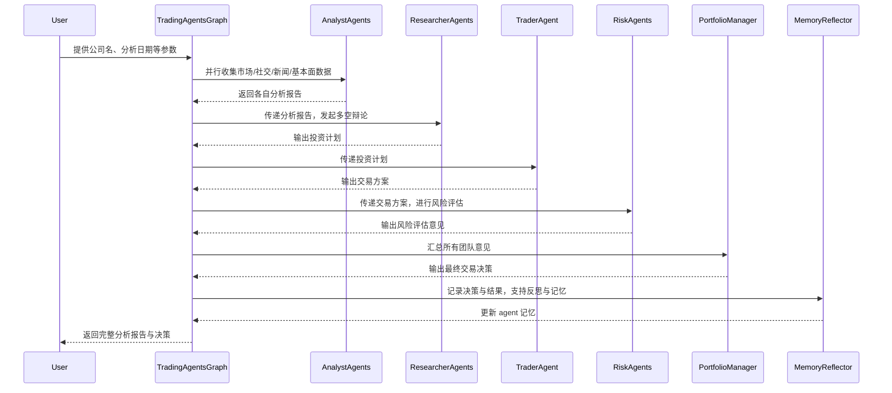
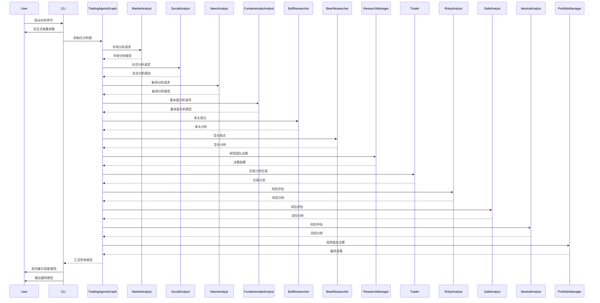

# run_analysis()[cli.main.py]

> 运行命令 `python -m cli.main`

TradingAgents CLI 的核心分析流程入口，负责收集用户输入、检查配置、初始化分析环境、实时展示进度，并最终输出完整报告。主要运行流程如下：

1. 收集用户输入：通过 get_user_selections()，交互式获取市场类型、股票代码、分析日期、分析师团队、研究深度、LLM服务商、思考智能体等参数。

2. 检查API密钥：调用 check_api_keys()，确保所选 LLM 服务商和金融数据源的 API 密钥已配置，否则终止分析并提示用户。

3. 配置参数：根据用户选择，复制并调整 DEFAULT_CONFIG，设置研究深度、LLM模型、后端URL等。

4. 初始化分析图：创建 TradingAgentsGraph 实例，传入分析师列表和配置参数，若初始化失败则提示错误。

5. 创建分析结果和报告保存目录，初始化消息日志文件。

6. 装饰消息与报告保存方法
- save_message_decorator：给 add_message 方法加装饰器。每次添加消息后，会把消息的时间、类型和内容写入日志文件（去掉换行）。
- save_tool_call_decorator：给 add_tool_call 方法加装饰器。每次调用工具后，会把调用的时间、工具名和参数写入日志文件。
- save_report_section_decorator：给 update_report_section 方法加装饰器。每次更新报告某个部分后，会把内容保存到对应的 Markdown 文件里。

7. 创建并实时刷新展示布局：使用 rich 的 Live 布局，展示欢迎信息、进度表、消息、当前报告等。

8. 初始化workflow状态：1）`message_buffer.update_agent_status(agent, "pending")` 重置所有智能体状态为 pending；2）`message_buffer.report_sections[section] = None` 将 report_sections 里的每个部分都重置为 None。

9. 启动分析流程：调用 TradingAgentsGraph 的 stream 方法，逐步获取分析过程的每个阶段数据（chunk），包括消息、工具调用、各团队报告等。
- `for chunk in graph.graph.stream(init_agent_state, **args):`
    > 1. .stream() 的含义:
    >       - graph.graph 是一个多智能体分析流程图（由 TradingAgentsGraph 初始化，实际类型通常是 StateGraph 或类似的 LangGraph 对象）。
    >      - .stream() 是该流程图的流式执行方法，它会逐步推进流程，每一步返回当前的状态快照（chunk），而不是一次性返回最终结果。
    >      - 这种流式执行方式可以让你实时获取每个节点的输出、消息、报告等，便于动态展示进度和中间结果。
    > 2. chunk 的含义:
    >      - chunk 是流程图每一步的状态快照，本质是一个字典，包含当前节点的所有输出内容。
    >      - 典型内容包括：
    >          - "messages"：当前节点输出的消息列表（如分析师的推理、工具调用等）
    >          - 各类报告（如 "market_report"、"news_report" 等）
    >          - 当前节点的状态（如投资辩论状态、风险辩论状态等）
    >      - 每次循环，chunk 反映了流程图当前推进到哪个节点、产生了哪些新内容。
- `if "market_report" in chunk and chunk["market_report"]:`表示 Market Analyst 已经完成分析（因为 market_report 已经生成）
    > 在 chunk 循环中，为什么用 if 判断来更新分析师状态？会不会出现已经 completed 的分析师又被更新为 in_progress？
    > 1. 为什么用 if 判断
    >   每个 if 判断（如 if "market_report" in chunk and chunk["market_report"]:）是为了检测当前 chunk 是否包含某个分析师的报告输出，只有报告生成时才更新状态。这样可以保证只有在节点真正完成分析时，才会推进流程和状态。
    > 2. 状态更新机制
    >   代码逻辑是：当前分析师完成（设为 completed），下一个分析师才设为 in_progress。
    >       ```python
    >       message_buffer.update_agent_status("Market Analyst", "completed")
    >       if "social" in selections["analysts"]:
    >           message_buffer.update_agent_status("Social Analyst", "in_progress")
    >       ```
    >       这种串行推进方式，理论上不会让已经 completed 的分析师又变成 in_progress，因为每个分析师的报告只会在流程推进到该节点时生成一次。
    > 3. 是否会重复更新为 in_progress？正常情况下不会。因为：
    >   流程图是串行的，每个分析师节点只会被激活一次，报告只会生成一次。
    >   只有在 chunk 包含新报告时才会触发状态更新。
    >   一旦分析师状态被设为 completed，后续 chunk 不会再包含该分析师的报告（除非流程图设计有问题）。
10. 实时更新展示与状态
每收到新 chunk，解析并更新消息、工具调用、报告内容、智能体状态，刷新展示面板。

11. 处理各团队分析阶段
按顺序处理分析师团队、研究团队、交易团队、风险管理团队、投资组合管理团队的报告和状态变更。

12. 分析结束，输出完整报告
分析流程结束后，调用 display_complete_report() 展示所有团队的最终分析结果。

13. 收尾与展示
更新所有智能体状态为 completed，保存最终报告，刷新展示。



