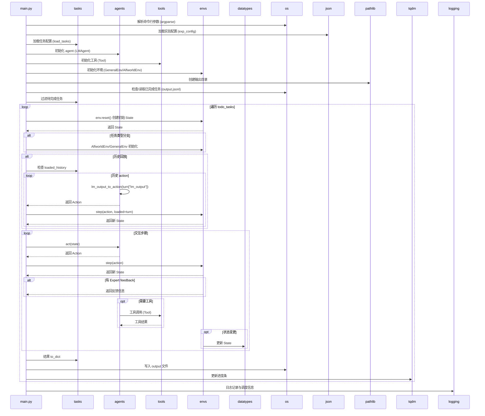

# CodeAct 全局交互时序图（main.py 出发，mint 目录核心模块）

```mermaid
sequenceDiagram
    participant main.py
    participant tasks
    participant agents
    participant tools
    participant envs
    participant datatypes
    %% 配置与初始化流程
    main.py->>os: 解析命令行参数 (argparse)
    main.py->>json: 加载实验配置 (exp_config)
    main.py->>tasks: 加载任务配置 (load_tasks)
    main.py->>agents: 初始化 agent (LMAgent)
    main.py->>tools: 初始化工具 (Tool)
    main.py->>envs: 初始化环境 (GeneralEnv/AlfworldEnv)
    main.py->>pathlib: 创建输出目录
    main.py->>os: 检查/读取已完成任务 (output.jsonl)
    main.py->>tasks: 过滤待完成任务
    %% 任务主循环
    loop 遍历 todo_tasks
        main.py->>envs: env.reset() 创建初始 State
        envs-->>main.py: 返回 State
        alt 任务类型分支
            main.py->>envs: AlfworldEnv/GeneralEnv 初始化
        end
        alt 历史回放
            main.py->>tasks: 检查 loaded_history
            loop 历史 action
                agents->>agents: lm_output_to_action(turn["lm_output"])
                agents-->>main.py: 返回 Action
                main.py->>envs: step(action, loaded=turn)
                envs-->>main.py: 返回新 State
            end
        end
        loop 交互步骤
            main.py->>agents: act(state)
            agents-->>main.py: 返回 Action
            main.py->>envs: step(action)
            envs-->>main.py: 返回新 State
            alt 有 Expert feedback
                envs-->>main.py: 返回反馈信息
            end
            opt 需要工具
                agents->>tools: 工具调用 (Tool)
                tools-->>agents: 工具结果
            end
            opt 状态变更
                envs->>datatypes: 更新 State
            end
        end
        main.py->>tasks: 结果 to_dict
        main.py->>os: 写入 output 文件
        main.py->>tqdm: 更新进度条
    end
    main.py->>logging: 日志记录与调度信息
```

---
此时序图覆盖 main.py 及 mint 目录下 tasks、agents、tools、envs、datatypes 等核心模块的调用与数据流动。可用 Mermaid 工具或 VSCode 插件进行可视化。
如需进一步细化某一模块内部流程，可继续补充！
