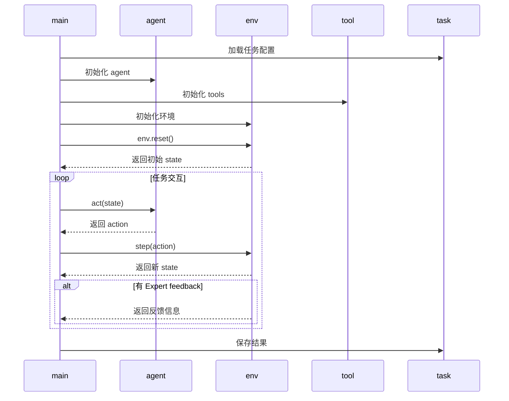

# main.py 项目交互时序图



---
此图为时序图，展示了 main.py 各模块间的调用与数据流动，适合理解交互过程。可用 Mermaid 工具可视化。


# mint/envs 目录类继承关系与设计说明

## 1. 继承关系概览
```
base.py      -> class BaseEnv(ABC)
                  |-- 定义所有环境的抽象基类，约定核心接口
general_env.py -> class GeneralEnv(BaseEnv)
                  |-- 通用环境实现，支持工具调用、反馈、任务判定等
alfworld_env.py -> class AlfworldEnv(GeneralEnv)
                  |-- AlfWorld专用环境，扩展工具集与成功判定逻辑
```

## 2. 各类功能与主要方法

### BaseEnv (mint/envs/base.py)
- 作用：所有环境的抽象基类，约定必须实现 `step` 和 `reset` 两个方法。
- 主要方法：
  - `step(action: Action) -> State`：执行一步环境交互，返回新状态。
  - `reset() -> State`：重置环境，返回初始状态。

### GeneralEnv (mint/envs/general_env.py)
- 作用：实现通用任务环境，支持工具调用、反馈机制、任务判定、状态管理等。
- 主要方法：
  - `__init__`：环境初始化，绑定任务、工具集、反馈agent、配置等。
  - `parse_action`：解析 agent 动作，区分答案型与工具调用型。
  - `get_feedback`：根据配置调用反馈 agent，获取反馈内容。
  - `check_task_success`：判定任务是否成功。
  - `log_output`：记录环境输出到状态。
  - `handle_tool_call`：处理工具调用动作，执行工具并返回观察结果。
  - `handle_propose_solution`：处理答案型动作，判定任务成功与否。
  - `check_max_iteration`：检查是否达到最大迭代次数，自动终止任务。
  - `step`：环境一步交互，综合处理动作、反馈、状态变更。
  - `reset`：环境重置，构建用户提示、初始化状态与工具集。
  - `__del__`：析构函数，清理任务资源。

### AlfworldEnv (mint/envs/alfworld_env.py)
- 作用：针对 AlfWorld 任务的专用环境，扩展工具集与成功判定逻辑。
- 主要方法：
  - `__init__`：初始化环境，扩展工具集，绑定底层环境，调用父类初始化。
  - `check_task_success`：通过工具调用结果判定任务是否成功（覆盖父类）。
  - `handle_tool_call`：处理工具调用，判定任务成功后自动终止（覆盖父类）。

## 3. 设计思路与调用流程
- 统一接口：所有环境类都实现 `step` 和 `reset`，便于主流程统一调度。
- 通用扩展：GeneralEnv 提供通用环境能力，支持多种任务和工具。
- 专用扩展：AlfworldEnv 针对特定任务（如 AlfWorld）扩展工具集和判定逻辑。
- 反馈机制：通过 agent 配置和反馈类型灵活支持多种反馈方式。
- 工具调用：支持多种工具（如 PythonREPL），可扩展更多类型。
- 状态管理：每步交互均记录历史、最新输出、计数器，便于追踪和分析。

## 4. 典型调用思路
- 主流程初始化环境（如 GeneralEnv/AlfworldEnv），调用 `reset` 获取初始状态。
- 每步交互调用 `step(action)`，自动处理工具调用/答案判定/反馈/状态变更。
- 工具调用和答案判定均有专门方法，便于扩展和覆盖。
- 任务结束后自动清理资源。

如需进一步细化某个类或方法的实现细节，请告知！