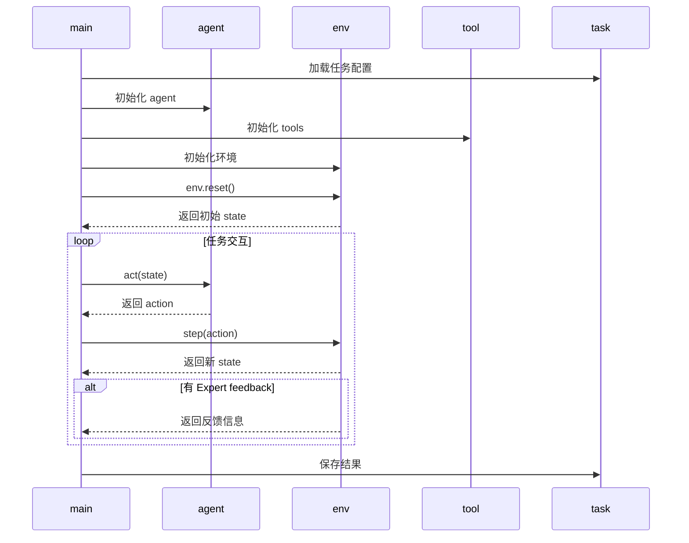

# main.py 项目交互时序图



---
此图为时序图，展示了 main.py 各模块间的调用与数据流动，适合理解交互过程。可用 Mermaid 工具可视化。


# mint/envs 目录类继承关系与设计说明

## 1. 继承关系概览
```
base.py      -> class BaseEnv(ABC)
                  |-- 定义所有环境的抽象基类，约定核心接口
general_env.py -> class GeneralEnv(BaseEnv)
                  |-- 通用环境实现，支持工具调用、反馈、任务判定等
alfworld_env.py -> class AlfworldEnv(GeneralEnv)
                  |-- AlfWorld专用环境，扩展工具集与成功判定逻辑
```

## 2. 各类功能与主要方法

### BaseEnv (mint/envs/base.py)
- 作用：所有环境的抽象基类，约定必须实现 `step` 和 `reset` 两个方法。
- 主要方法：
  - `step(action: Action) -> State`：执行一步环境交互，返回新状态。
  - `reset() -> State`：重置环境，返回初始状态。

### GeneralEnv (mint/envs/general_env.py)
- 作用：实现通用任务环境，支持工具调用、反馈机制、任务判定、状态管理等。
- 主要方法：
  - `__init__`：环境初始化，绑定任务、工具集、反馈agent、配置等。
  - `parse_action`：解析 agent 动作，区分答案型与工具调用型。
  - `get_feedback`：根据配置调用反馈 agent，获取反馈内容。
  - `check_task_success`：判定任务是否成功。
  - `log_output`：记录环境输出到状态。
  - `handle_tool_call`：处理工具调用动作，执行工具并返回观察结果。
  - `handle_propose_solution`：处理答案型动作，判定任务成功与否。
  - `check_max_iteration`：检查是否达到最大迭代次数，自动终止任务。
  - `step`：环境一步交互，综合处理动作、反馈、状态变更。
  - `reset`：环境重置，构建用户提示、初始化状态与工具集。
  - `__del__`：析构函数，清理任务资源。

### AlfworldEnv (mint/envs/alfworld_env.py)
- 作用：针对 AlfWorld 任务的专用环境，扩展工具集与成功判定逻辑。
- 主要方法：
  - `__init__`：初始化环境，扩展工具集，绑定底层环境，调用父类初始化。
  - `check_task_success`：通过工具调用结果判定任务是否成功（覆盖父类）。
  - `handle_tool_call`：处理工具调用，判定任务成功后自动终止（覆盖父类）。

## 3. 设计思路与调用流程
- 统一接口：所有环境类都实现 `step` 和 `reset`，便于主流程统一调度。
- 通用扩展：GeneralEnv 提供通用环境能力，支持多种任务和工具。
- 专用扩展：AlfworldEnv 针对特定任务（如 AlfWorld）扩展工具集和判定逻辑。
- 反馈机制：通过 agent 配置和反馈类型灵活支持多种反馈方式。
- 工具调用：支持多种工具（如 PythonREPL），可扩展更多类型。
- 状态管理：每步交互均记录历史、最新输出、计数器，便于追踪和分析。

## 4. 典型调用思路
- 主流程初始化环境（如 GeneralEnv/AlfworldEnv），调用 `reset` 获取初始状态。
- 每步交互调用 `step(action)`，自动处理工具调用/答案判定/反馈/状态变更。
- 工具调用和答案判定均有专门方法，便于扩展和覆盖。
- 任务结束后自动清理资源。


# mint/agents 目录交互分析与理解指导

## 1. 结构与继承关系
```
base.py                -> class LMAgent
                            |-- 所有智能体的基类，定义通用接口
openai_lm_agent.py     -> class OpenAILMAgent(LMAgent)
                            |-- OpenAI大模型通用Agent
vllm_agent.py          -> class VLLMAgent(OpenAILMAgent)
                            |-- VLLM推理框架Agent
claude_agent.py        -> class ClaudeLMAgent(LMAgent)
                            |-- Claude模型Agent
bard_agent.py          -> class BardLMAgent(LMAgent)
                            |-- Bard模型Agent
openai_feedback_agent.py -> class OpenAIFeedbackAgent(OpenAILMAgent)
                            |-- OpenAI反馈Agent
claude_feedback_agent.py -> class ClaudeFeedbackAgent(OpenAILMAgent)
                            |-- Claude反馈Agent
vllm_feedback_agent.py   -> class VLLMFeedbackAgent(OpenAILMAgent)
                            |-- VLLM反馈Agent
```

## 2. 关键交互与数据流
- agents 目录下所有 Agent 类都依赖 mint/datatypes.py 的 Action、State 数据结构。
- Agent 的 `act(state)` 方法会接收环境（envs）传来的 State，并返回 Action，驱动主流程继续。
- Agent 的 `lm_output_to_action` 方法将底层大模型输出（如字符串）转为 Action，供环境和主流程使用。
- 反馈型 Agent（如 OpenAIFeedbackAgent）会与环境的反馈机制协作，辅助评测和人类反馈模拟。
- Agent 的初始化通常需要配置（config），这些配置由 main.py 主流程解析并传入。

## 3. 与主流程的协作
- main.py 初始化 Agent 时，会根据配置选择不同的 Agent 子类（如 OpenAILMAgent、VLLMAgent）。
- 在每步交互中，main.py 会将当前 State 传给 Agent 的 `act` 方法，Agent 处理后返回 Action。
- Action 对象会被传递给 envs 环境模块，驱动环境状态变更。
- 反馈型 Agent 在需要评测或反馈时被调用，辅助主流程完成评测闭环。

## 4. 如何理解和追踪 agents 交互
- 追踪主流程时，关注 Agent 的 `act(state)` 如何根据 State 生成 Action。
- 理解 Action/State 的结构和流动，有助于串联 agents、envs、tasks、tools 等模块的数据协作。
- 关注 Agent 的底层实现（如 call_lm、format_prompt），可深入理解与大模型API的交互细节。
- 反馈型 Agent 的 act 方法与环境的 get_feedback、handle_propose_solution 等方法协作，形成完整评测链路。

## 5. 典型调用链
- main.py -> Agent(act) -> Action -> Env(step) -> State -> Agent ...
- main.py -> FeedbackAgent(act) -> Action/反馈 -> Env/主流程

通过上述分析，你可以从 agents 目录出发，串联理解整个项目的数据流和模块协作，掌握主流程的核心驱动机制。

如需进一步细化某个 Agent 类或方法的实现细节，请告知！