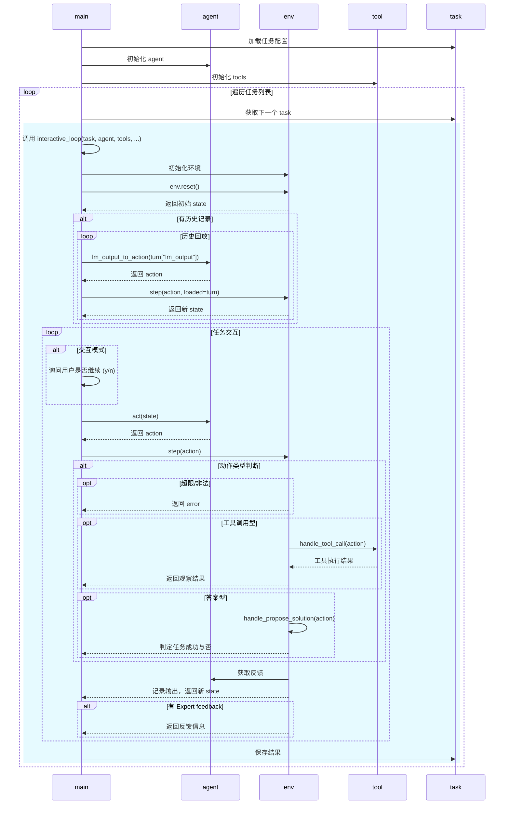
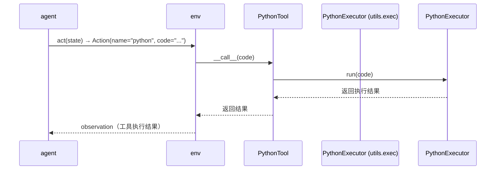

# main.py 项目交互时序图



---
此图为时序图，展示了 main.py 各模块间的调用与数据流动，适合理解交互过程。可用 Mermaid 工具可视化。


# mint/envs 目录类继承关系与设计说明（详细注释版）

## 1. 结构与继承关系
```
base.py      -> class BaseEnv(ABC)
    |-- 环境抽象基类，约定必须实现 step 和 reset 两个方法。
general_env.py -> class GeneralEnv(BaseEnv)
    |-- 通用环境类，支持工具调用、反馈机制、任务判定、状态管理等。
alfworld_env.py -> class AlfworldEnv(GeneralEnv)
    |-- AlfWorld 专用环境类，扩展工具集与成功判定逻辑。
```

## 2. 关键方法与功能说明

### BaseEnv (mint/envs/base.py)
- 作用：所有环境的抽象基类，约定必须实现 `step` 和 `reset` 两个方法。
- 主要方法：
  - `step(action: Action) -> State`：执行一步环境交互，返回新状态。
  - `reset() -> State`：重置环境，返回初始状态。

### GeneralEnv (mint/envs/general_env.py)
- 作用：实现通用任务环境，支持工具调用、反馈机制、任务判定、状态管理等。
- 主要方法：
  - `__init__`：环境初始化，绑定任务、工具集、反馈 agent、配置等。
  - `parse_action`：解析 agent 动作，区分答案型与工具调用型。
  - `get_feedback`：根据配置调用反馈 agent，获取反馈内容。
  - `check_task_success`：判定任务是否成功。
  - `log_output`：记录环境输出到状态。
  - `handle_tool_call`：处理工具调用动作，执行工具并返回观察结果。
  - `handle_propose_solution`：处理答案型动作，判定任务成功与否。
  - `check_max_iteration`：检查是否达到最大迭代次数，自动终止任务。
  - `step`：环境一步交互，综合处理动作、反馈、状态变更。
  - `reset`：环境重置，构建用户提示、初始化状态与工具集。
  - `__del__`：析构函数，清理任务资源。

### AlfworldEnv (mint/envs/alfworld_env.py)
- 作用：针对 AlfWorld 任务的专用环境，扩展工具集与成功判定逻辑。
- 主要方法：
  - `__init__`：初始化环境，扩展工具集，绑定底层环境，调用父类初始化。
  - `check_task_success`：通过工具调用结果判定任务是否成功（可覆盖父类）。
  - `handle_tool_call`：处理工具调用，判定任务成功后自动终止（可覆盖父类）。

## 3. 设计思路与调用流程
- 统一接口：所有环境类都实现 `step` 和 `reset`，便于主流程统一调度。
- 通用扩展：GeneralEnv 提供通用环境能力，支持多种任务和工具。
- 专用扩展：AlfworldEnv 针对特定任务（如 AlfWorld）扩展工具集和判定逻辑。
- 反馈机制：通过 agent 配置和反馈类型灵活支持多种反馈方式。
- 工具调用：支持多种工具（如 PythonREPL），可扩展更多类型。
- 状态管理：每步交互均记录历史、最新输出、计数器，便于追踪和分析。

## 4. 典型调用思路
- 主流程初始化环境（如 GeneralEnv/AlfworldEnv），调用 `reset` 获取初始状态。
- 每步交互调用 `step(action)`，自动处理工具调用/答案判定/反馈/状态变更。
- 工具调用和答案判定均有专门方法，便于扩展和覆盖。
- 任务结束后自动清理资源。


# mint/agents 目录交互分析与理解指导（详细注释版）

## 1. 结构与继承关系
```
base.py                -> class LMAgent
    |-- 智能体基类，定义通用接口和行为规范。
openai_lm_agent.py     -> class OpenAILMAgent(LMAgent)
    |-- OpenAI大模型 Agent，负责与 OpenAI API 交互。
vllm_agent.py          -> class VLLMAgent(OpenAILMAgent)
    |-- VLLM 推理 Agent，支持开源模型，接口与 OpenAI API 兼容。
claude_agent.py        -> class ClaudeLMAgent(LMAgent)
    |-- Claude大模型 Agent，负责与 Anthropic Claude API 交互。
bard_agent.py          -> class BardLMAgent(LMAgent)
    |-- Bard大模型 Agent，负责与 Google PaLM API 交互。
openai_feedback_agent.py -> class OpenAIFeedbackAgent(OpenAILMAgent)
    |-- OpenAI反馈型 Agent，专用于生成评估或反馈。
claude_feedback_agent.py -> class ClaudeFeedbackAgent(OpenAILMAgent)
    |-- Claude反馈型 Agent，专用于生成评估或反馈。
vllm_feedback_agent.py   -> class VLLMFeedbackAgent(OpenAILMAgent)
    |-- VLLM反馈型 Agent，支持开源模型反馈。
```

## 2. 关键交互与数据流
- 所有 Agent 类都依赖 mint/datatypes.py 的 Action、State 数据结构。
- Agent 的 `act(state)` 方法接收环境（envs）传来的 State，并返回 Action，驱动主流程继续。
- Agent 的 `lm_output_to_action` 方法将底层大模型输出（如字符串）转为 Action，供环境和主流程使用。
- 反馈型 Agent（如 OpenAIFeedbackAgent、ClaudeFeedbackAgent、VLLMFeedbackAgent）会与环境的反馈机制协作，辅助评测和人类反馈模拟。
- Agent 的初始化通常需要配置（config），这些配置由 main.py 主流程解析并传入。

## 3. 主要方法说明
- `__init__`：初始化 Agent，绑定配置参数，设置停用词，保证输出规范。
- `act(state)`：Agent 的核心决策方法，输入为当前环境状态 State，输出为 Action。需在子类实现具体推理逻辑。
- `call_lm(messages)`：调用底层大模型 API（如 OpenAI、Claude、Bard、VLLM），获取回复。
- `lm_output_to_action(lm_output)`：将模型输出字符串转换为 Action 对象，区分工具调用和最终答案。
- `add_system_message(messages)`：将用户消息中的 system prompt 拆分出来，作为系统消息，用于 prompt 工程。

## 4. 与主流程的协作
- main.py 初始化 Agent 时，根据配置选择不同的 Agent 子类（如 OpenAILMAgent、VLLMAgent、ClaudeLMAgent、BardLMAgent）。
- 每步交互中，main.py 将当前 State 传给 Agent 的 `act` 方法，Agent 处理后返回 Action。
- Action 对象被传递给 envs 环境模块，驱动环境状态变更。
- 反馈型 Agent 在需要评测或反馈时被调用，辅助主流程完成评测闭环。

## 5. 典型调用链
- main.py -> Agent(act) -> Action -> Env(step) -> State -> Agent ...
- main.py -> FeedbackAgent(act) -> Action/反馈 -> Env/主流程

通过上述分析，你可以从 agents 目录出发，串联理解整个项目的数据流和模块协作，掌握主流程的核心驱动机制。

# mint/tasks 目录类设计与交互分析（详细注释版）

## 1. 结构与继承关系
```
base.py      -> class Task(ABC)
    |-- 任务抽象基类，约定必须实现 get_prompt 方法。
alfworld.py  -> class AlfWorldTask(Task)
    |-- AlfWorld 专用任务类，封装环境与任务实例。
```

## 2. 主要方法与功能说明

### Task (mint/tasks/base.py)
- 作用：所有任务的抽象基类，约定必须实现 `get_prompt` 方法。
- 主要属性：
  - name: 任务名称。
  - description: 任务描述。
  - stop_conditions: 停止条件列表。
- 主要方法：
  - `get_prompt()`：返回任务的初始指令。

### AlfWorldTask (mint/tasks/alfworld.py)
- 作用：AlfWorld 专用任务类，继承自 Task。
- 主要属性：
  - id: 任务唯一标识。
  - prompt: 任务指令。
  - reference: 参考答案。
  - env: AlfWorld 环境实例。
  - task_type: 任务类型字符串。
- 主要方法：
  - `get_prompt()`：返回任务的初始指令。

## 3. 设计思路与调用流程
- 统一接口：所有任务类都实现 `get_prompt`，便于主流程统一调度。
- 专用扩展：AlfWorldTask 针对特定任务扩展环境和判定逻辑。

## 4. 典型调用思路
- 主流程初始化任务（如 Task/AlfWorldTask），调用 `get_prompt` 获取初始指令。
- 环境根据任务判定成功与否，驱动主流程。

# Agent 与 PythonTool 的交互机制说明

1. **Agent 决策**  
   Agent 在每一步交互中，根据当前环境状态（State）决定下一步动作（Action）。Action 可以是工具调用型（如调用 PythonTool），也可以是文本型答案。

2. **Action 结构**  
   当 Agent 需要调用工具时，会生成一个 Action，其中包含工具名称（如 `"python"`）和参数（如要执行的代码字符串）。

3. **环境处理**  
   环境（Env）在 `step(action)` 方法中解析 Action。如果 Action 是工具调用型，则会调用 `handle_tool_call` 方法。

4. **工具调用**  
   `handle_tool_call` 会根据 Action 中指定的工具名称，找到对应的 Tool 实例（如 PythonTool），并将参数（如代码字符串）传递给 Tool 的 `__call__` 方法。

5. **PythonTool 执行**  
   PythonTool 的 `__call__` 方法会调用 `python_executor.run(code)`，执行代码并返回结果。

6. **结果返回**  
   工具执行结果会被环境收集，作为 observation（观察结果）返回给 Agent，Agent 再根据新的 State 做下一步决策。

**简化流程图：**

```markdown
agent.act(state) → Action（工具调用型） 
env.step(Action) → handle_tool_call → tool.call(code)
tool 执行并返回结果 → env 记录结果 → agent 获取新 state
```
## PythonTool 调用与执行时序交互图

