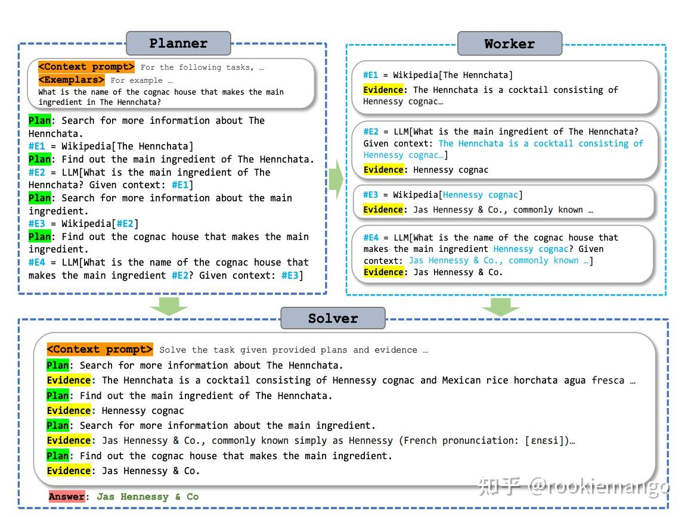
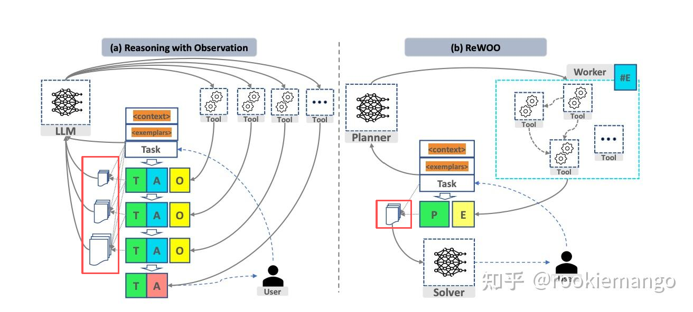

# 经典ReAct论文
> ReAct: Synergizing Reasoning and Acting in Language Models

结合语言模型中的推理（reasoning）和行动（acting）来解决多样化的语言推理和决策任务。
它的典型流程如下图所示，可以用一个有趣的循环来描述：思考（Thought）→ 行动（Action）→ 观察（Observation），简称**TAO循环**。
- 思考（Thought）：面对一个问题，我们需要进行深入的思考。这个思考过程是关于如何定义问题、确定解决问题所需的关键信息和推理步骤。
- 行动（Action）：确定了思考的方向后，接下来就是行动的时刻。根据我们的思考，采取相应的措施或执行特定的任务，以期望推动问题向解决的方向发展。
- 观察（Observation）：行动之后，我们必须仔细观察结果。这一步是检验我们的行动是否有效，是否接近了问题的答案。
- 循环迭代

prompt示例：
```text
def build_react_prompt(tools: List[StructuredTool], user_query: str) -> str:
    """
    构建ReAct模式的Prompt（对应原代码的REACT_PROMPT）
    :param tools: 可用工具列表
    :param user_query: 用户问题
    :return: 完整Prompt字符串
    """
    # 1. 生成工具描述（对应原代码的TOOL_DESC）
    tool_descs = "\n".join([f"- {tool.get_schema()}" for tool in tools])
    
    # 2. ReAct核心格式模板（强制LLM按此格式输出）
    react_template = f"""Answer the following questions as best you can. You have access to the following tools:
{tool_descs}

Use the following format strictly (do NOT omit any part):
Question: the input question you must answer
Thought: You should analyze what to do next (e.g., "I need to calculate the total purchase cost first")
Action: the tool to use (MUST be one of [{', '.join([t.name for t in tools])}])
Action Input: the input to the tool (MUST follow the tool's input format, e.g., [750, 12])
Observation: the result of the Action (you will get this later, do NOT fill it now)
... (repeat Thought/Action/Action Input/Observation zero or more times)
Thought: I now know the final answer
Final Answer: the final answer to the original question (in Chinese, include specific numbers)

Begin!
Question: {user_query}"""
    
    return react_template
```

构建Agent：llm、tools集合、stop循环停止条件
```python
class LLMSingleActionAgent {
  llm: AzureLLM
  tools: StructuredTool[]
  stop: string[]
  private _prompt: string = '{input}'
  constructor({ llm, tools = [], stop = [] }: LLMSingleActionAgentParams) {
    this.llm = llm
    this.tools = tools
    if (stop.length > 4)
      throw new Error('up to 4 stop sequences')
    this.stop = stop
  }
 }
```

定义Tools：name、description
```
class StructuredTool(ABC):
    """抽象工具类（对应原代码的StructuredTool）"""
    def __init__(self, name: str, description: str):
        self.name = name  # 工具函数名（LLM需识别此名称）
        self.description = description  # 工具功能描述（关键：LLM靠此判断是否使用）

    @abstractmethod
    def call(self, tool_input: str) -> str:
        """抽象方法：执行工具逻辑，输入为字符串，输出为执行结果字符串"""
        pass

    @property
    @abstractmethod
    def declaration(self) -> str:
        """抽象属性：工具声明（用于Prompt中告知LLM工具格式）"""
        pass

    def get_schema(self) -> str:
        """生成工具Schema（对应原代码的getSchema）"""
        return f"{self.declaration} | {self.name} | {self.description}"


# ------------------------------
# 具体工具实现（对应原代码的4个算数工具）
# ------------------------------
class AdditionTool(StructuredTool):
    def __init__(self):
        super().__init__(
            name="Addition Tool",
            description="用于计算两个或多个数字的和（输入格式：[a, b, ...]，如[10, 20]）"
        )

    def call(self, tool_input: str) -> str:
        """执行加法：解析输入列表中的数字并求和"""
        try:
            # 解析输入（如"[750, 12]" → [750, 12]）
            numbers = eval(tool_input.strip())  # 实际生产环境建议用json.loads，避免安全风险
            if not isinstance(numbers, list) or not all(isinstance(n, (int, float)) for n in numbers):
                return "输入格式错误！请传入数字列表（如[10, 20]）"
            return str(sum(numbers))
        except Exception as e:
            return f"计算失败：{str(e)}"

    @property
    def declaration(self) -> str:
        return "加法工具"
```

循环执行:执行器executor是在Agent的运行时，协调各个组件并指导操作
```python
class LLMSingleActionAgent:
    """ReAct单步Agent（对应原代码的LLMSingleActionAgent）"""
    def __init__(self, llm_model_name: str, tools: List[StructuredTool] = None, stop: List[str] = None):
        self.llm_model_name = llm_model_name  # LLM模型名
        self.tools = tools or []  # 可用工具列表
        self.stop = stop or ["Observation:"]  # 停止序列（避免LLM提前生成Observation）
        self.prompt_template = None  # Prompt模板（通过set_prompt设置）

    def set_prompt(self, prompt_template: str):
        """设置Prompt模板（对应原代码的setPrompt）"""
        self.prompt_template = prompt_template

    def add_stop(self, stop_str: str):
        """添加停止序列（对应原代码的addStop）"""
        if stop_str not in self.stop:
            self.stop.append(stop_str)

    def add_tool(self, tool: StructuredTool):
        """添加工具（对应原代码的addTool）"""
        if tool not in self.tools:
            self.tools.append(tool)

    def plan(self, history_steps: List[Dict], user_query: str) -> Dict:
        """
        核心方法：根据历史步骤规划下一步行动（对应原代码的plan）
        :param history_steps: 历史步骤列表（每个步骤含"thought"/"action"/"action_input"/"observation"）
        :param user_query: 用户原始问题
        :return: 下一步行动（含thought/action/action_input，或final_answer）
        """
        # 1. 拼接历史步骤到Prompt
        history_str = ""
        for step in history_steps:
            history_str += f"""Thought: {step['thought']}
Action: {step['action']}
Action Input: {step['action_input']}
Observation: {step['observation']}\n"""

        # 2. 完整Prompt = 模板 + 历史步骤
        full_prompt = f"{self.prompt_template}\n{history_str}"

        # 3. 调用LLM生成下一步输出
        response = openai.ChatCompletion.create(
            engine=self.llm_model_name,
            messages=[{"role": "user", "content": full_prompt}],
            temperature=0.0,  # 降低随机性，确保按格式输出
            stop=self.stop  # 停止在"Observation:"前，避免LLM虚构结果
        )
        llm_output = response.choices[0].message["content"].strip()

        # 4. 解析LLM输出（提取Thought/Action/Action Input或Final Answer）
        return self._parse_llm_output(llm_output)

    @staticmethod
    def _parse_llm_output(llm_output: str) -> Dict:
        """解析LLM输出，提取关键信息（容错处理LLM格式偏差）"""
        # 匹配Final Answer（若已完成）
        final_answer_match = re.search(r"Final Answer:\s*(.*)", llm_output, re.IGNORECASE)
        if final_answer_match:
            return {
                "is_finished": True,
                "final_answer": final_answer_match.group(1).strip()
            }

        # 匹配Thought/Action/Action Input（若需继续行动）
        thought_match = re.search(r"Thought:\s*(.*)", llm_output, re.IGNORECASE)
        action_match = re.search(r"Action:\s*(.*)", llm_output, re.IGNORECASE)
        action_input_match = re.search(r"Action Input:\s*(.*)", llm_output, re.IGNORECASE)

        if not all([thought_match, action_match, action_input_match]):
            raise ValueError(f"LLM输出格式错误，无法解析：\n{llm_output}")

        return {
            "is_finished": False,
            "thought": thought_match.group(1).strip(),
            "action": action_match.group(1).strip(),
            "action_input": action_input_match.group(1).strip()
        }
```

# REWOO 优化ReAct冗余问题：冗余计算，冗余会导致过多的计算开销和过长的Token使用
> ReWOO: Decoupling Reasoning from Observations for Efficient Augmented Language Models
> https://www.53ai.com/news/LargeLanguageModel/2024090103498.html [基于langgraph的代码实现]

以往大模型调用外部工具的流程是：获取响应，根据响应进行下一步操作。虽然简单易行，但通常会导致巨大的计算量，因为假如一个问题没法一次性解决，最后模型的输入就是随着询问次数增加而倍增的。

在本文中作者提出了将这些步骤都独立开来，也就是假设一个问题没法一次性解决，需要调用k次外部工具时，首先利用一个planner安排好k次独立的询问，利用worker对着k次询问分别进行查询，最后将planner设计好的独立询问+从worker得到的对于每一个询问的查询结果以及一些prompt信息输入给solver,由solver给出最终的结果。

ReWOO 旨在通过结合多步骤规划和变量替换来有效使用工具。这种设计意在改善 ReACT 风格代理架构，具体体现在以下几个方面：
- **减少令牌消耗和执行时间**：ReWOO 在单次调用中生成完整的工具链，而 ReACT 风格的代理架构需要多次调用大语言模型（LLM），并且每次推理步骤都要重复提供系统提示和先前步骤的内容。
- **简化微调过程**：由于规划数据不依赖于工具的输出，因此模型可以在不实际调用工具的情况下进行微调。

Fig. 1 Rewoo的主要思路。从图里面可以看出来的是，Q只会输入给Planner, Planner 会给出一个解决这个问题的步骤，并且甚至安排好该去那个外部工具进行查询。 Worker其实只需要调用api从网站or其他大模型得到相关的知识。最后solver的输入prompt + paired plan and evidence，然后给出answer to Q

general方法里面，每一轮从external tool 得到了T(though), A(action), O(observation)的信息之后，需要把这些信息同之前的T,A,O全部concatenate在一起然后再去得到新的T,A, O。这样就会大大增加 **input length** 和随之而来的**computation complexity**. 

1. 规划者:负责提示 LLM 生成计划，其格式为一系列任务列表。每个任务的参数是可能包含特殊变量（如 #E{0-9}+）的字符串，这些变量用于从其他任务结果中进行替换。
```
Plan: Use Google to search for the 2024 Australian Open winner.
#E1 = Google[2024 Australian Open winner]

Plan: Retrieve the name of the 2024 Australian Open winner from the search results.
#E2 = LLM[What is the name of the 2024 Australian Open winner, given #E1]

Plan: Use Google to search for the hometown of the 2024 Australian Open winner.
#E3 = Google[hometown of 2024 Australian Open winner, given #E2]
```

2. 执行者:接收计划并按顺序执行工具。它根据当前的任务状态决定要执行的步骤，并调用相应的工具。
```python
def tool_execution(state: ReWOO):
    """执行计划的工作节点。"""
    _step = _get_current_task(state)
    _, step_name, tool, tool_input = state["steps"][_step - 1]
    # 替换工具输入中的变量
    _results = state["results"] or {}
    for k, v in _results.items():
        tool_input = tool_input.replace(k, v)
    if tool == "Google":
        result = search.invoke(tool_input)
    elif tool == "LLM":
        result = model.invoke(tool_input)
    else:
        raise ValueError
    _results[step_name] = str(result)
    return {"results": _results}
```

3. 求解者:负责接收完整的计划，并根据执行者的工具调用结果生成最终的答案。
```python
def solve(state: ReWOO):
    plan = ""
    for _plan, step_name, tool, tool_input in state["steps"]:
        _results = state["results"] or {}
        for k, v in _results.items():
            tool_input = tool_input.replace(k, v)
            step_name = step_name.replace(k, v)
        plan += f"Plan: {_plan}\n{step_name} = {tool}[{tool_input}]"
    prompt = solve_prompt.format(plan=plan, task=state["task"])
    result = model.invoke(prompt)
    return {"result": result.content}
```

尽管 ReWOO 有很大的潜力，但也存在一些局限性，例如：

- 如果环境中的上下文信息有限，规划者可能无法有效使用工具。
- 任务仍然是顺序执行的，因此所有工具调用的总执行时间会受到影响。

