# 核心功能可分为六大主要功能
1. Wiki 生成 ——利用 AI 内容生成实现的自动化文档创建
2. 交互式聊天（Ask）——用于查询代码库的实时问答界面
3. 深度研究 ——针对复杂主题的多回合调查
4. 多提供者 AI 集成 ——支持多个 LLM 和嵌入provider
5. RAG 系统 - 用于上下文感知响应的检索增强生成
6. 存储库处理 ——智能文件过滤与内容准备

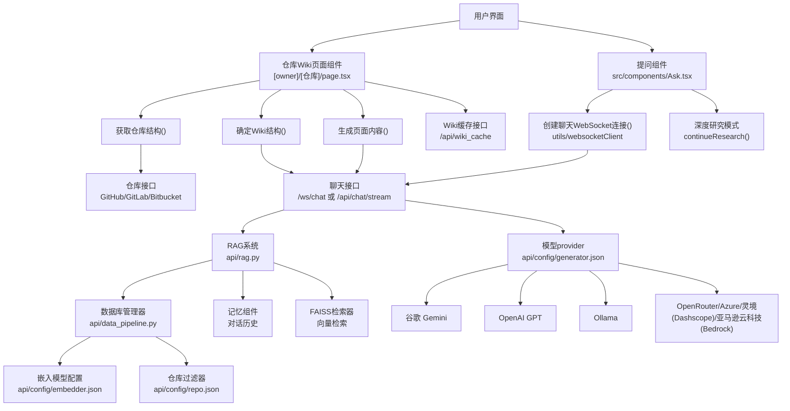

## 1. 维基生成
维基生成过程主要由前端的 RepoWikiPage 组件协调，该组件与后端 API 协调以实现：
1、检查是否有cached维基内容
2、克隆或读取目标仓库
3、利用 LLM 分析确定最优维基结构
4、同时为每个维基页面生成内容
5、缓存完整的维基，以便未来请求

该过程利用 WebSocket 和 HTTP 流式传输，在页面生成时提供实时反馈。该系统支持多种仓库type（GitHub、GitLab、Bitbucket、本地），并实现了复杂的缓存，以避免重新生成现有维基。

**端到端的生成流程：**
下图展示了完整的维基生成流程，从初始请求到缓存结果：
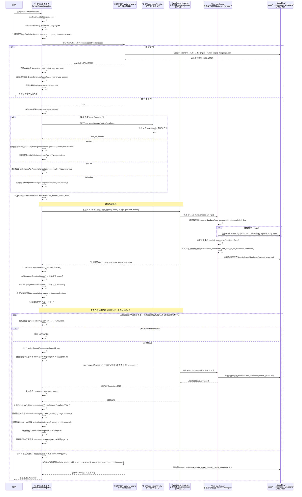
**页面生成流程图：**
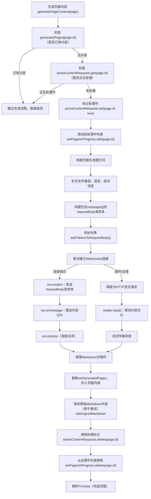

**1. 维基结构确定**
`detemineWikiStructure` 函数是 wiki 生成的第一步。它将仓库的文件树和 README 发送给 LLM，LLM 分析代码库并返回定义 wiki 组织的 XML 结构。
该函数构建一个详细的提示词(`src/app/[owner]/[repo]/page.tsx:712-832`)，包括：
- 完整文件树 ：所有仓库文件和目录
- README 内容 ：项目描述与文档
- 语言规范 ：维基内容的目标语言（基于语言参数）
- 结构模式 ：全面（8-12 页含章节）或简明（4-6 页平板）

提示模板根据 `isComprehensiveView` 状态而异。
对于综合维基，提示要求：
- 基于章节的组织（概述、系统架构、核心功能等）
- 各部分之间的父子关系
- 8-12页详细内容涵盖所有主要方面


对于简明的维基，提示请求：
- 平面页面结构（无章节）
- 4-6页聚焦于关键方面
- 精简组织

**2. XML 结构解析**
LLM 返回一个 XML 结构，系统通过浏览器的 DOMParser 进行解析。预期的结构包括：
```xml
<!-- Wiki结构根节点：包含整个仓库Wiki的元信息、章节、页面定义 -->
<wiki_structure>
  <!-- Wiki整体标题 -->
  <title>Repository Wiki Title</title>
  <!-- Wiki整体描述 -->
  <description>Brief description</description>

  <!-- 章节列表：用于组织页面的层级结构 -->
  <sections>
    <!-- 单个章节节点：id为唯一标识 -->
    <section id="section-1">
      <!-- 章节标题 -->
      <title>Section Title</title>
      <!-- 该章节下直接关联的页面引用（关联page.id） -->
      <pages>
        <page_ref>page-1</page_ref>
      </pages>
      <!-- 该章节的子章节引用（关联section.id） -->
      <subsections>
        <section_ref>section-2</section_ref>
      </subsections>
    </section>
  </sections>

  <!-- 页面列表：Wiki的核心内容页定义 -->
  <pages>
    <!-- 单个页面节点：id为唯一标识 -->
    <page id="page-1">
      <!-- 页面标题 -->
      <title>Page Title</title>
      <!-- 页面描述 -->
      <description>Page description</description>
      <!-- 页面重要性等级：high/medium/low 三选一 -->
      <importance>high|medium|low</importance>
      <!-- 页面关联的文件路径（仓库内的文件） -->
      <relevant_files>
        <file_path>src/file.ts</file_path>
      </relevant_files>
      <!-- 页面关联的其他页面（关联page.id） -->
      <related_pages>
        <related>page-2</related>
      </related_pages>
    </page>
  </pages>
</wiki_structure>
```
解析逻辑处理：
- 基于 DOM 的提取 ：使用 querySelector 和 querySelectorAll 查询 XML 元素
- 备用弹性 ：即使 XML 解析遇到小错误，也继续
- 分段层级 ：标识根段（不被其他分段引用）
- 页面关系 ：提取相关页面和父部分

**3. WikiStructure 数据模型**
解析后的 XML 被转换为 TypeScript 接口：
```TypeScript
interface WikiStructure {
  id: string;              // Always "wiki"
  title: string;           // Repository wiki title
  description: string;     // Repository description
  pages: WikiPage[];       // Array of all pages
  sections: WikiSection[]; // Array of sections (comprehensive mode only)
  rootSections: string[];  // Section IDs with no parent (comprehensive mode only)
}

interface WikiPage {
  id: string;              // Unique page ID (e.g., "page-1")
  title: string;           // Display title
  content: string;         // Markdown content (empty initially)
  filePaths: string[];     // Relevant source files
  importance: 'high' | 'medium' | 'low';
  relatedPages: string[];  // Related page IDs
  parentId?: string;       // Parent section ID (optional)
}

interface WikiSection {
  id: string;              // Unique section ID (e.g., "section-1")
  title: string;           // Section title
  pages: string[];         // Page IDs in this section
  subsections?: string[];  // Child section IDs (optional)
}
```

**4. 页面生成提示词构建**
每页的提示高度结构化，包含具体的技术文档说明。提示强调：
- 至少使用 5 个源文件进行全面覆盖
- 所有图的垂直方向 （graph TD，绝不graph LR）
- 每个主张必须附有必须引用的来源
- 严格的美人鱼语法用于序列图（参与者定义，正确箭头）
- 输出没有标记代码块封装器

```
You are an expert technical writer and software architect.
Your task is to generate a comprehensive technical wiki page...

[WIKI_PAGE_TOPIC]: {page.title}
[RELEVANT_SOURCE_FILES]: {page.filePaths}

CRITICAL STARTING INSTRUCTION:
<details>
<summary>Relevant source files</summary>
{filePaths mapped to links}
</details>

# {page.title}

Based ONLY on the content of the [RELEVANT_SOURCE_FILES]:
1. Introduction (1-2 paragraphs)
2. Detailed Sections (H2/H3 headings)
3. Mermaid Diagrams (flowchart TD, sequenceDiagram, etc.)
4. Tables (features, API endpoints, configuration)
5. Code Snippets (optional, directly from source files)
6. Source Citations (MANDATORY: <FileRef file-url="https://github.com/AsyncFuncAI/deepwiki-open/blob/cdf06314/filename#LNaN-LNaN" NaN  file-path="filename">Hii</FileRef> format)
7. Technical Accuracy (NO external knowledge)
8. Clarity and Conciseness
9. Conclusion/Summary

Language: {language}
```
确定维基结构后，系统会使用 `generatePageContent` 函数为每个页面生成内容。

---

Wiki 生成是 DeepWiki 的主要功能，将仓库转化为全面、结构化的文档。该过程包含三个主要阶段：
1、结构确定 ——AI 分析仓库文件树和 README，确定最佳维基结构
2、页面生成 ——每个页面通过流媒体内容更新顺序生成
3、缓存 ——完整的维基缓存在服务器端，便于即时检索

RepoWikiPage 组件通过 `detemineWikiStructure()` 和 `generatePageContent()` 函数协调这一过程。

关键实施细节：
- WebSocket 通信与 HTTP 缓冲：src/app/[owner]/[repo]/page.tsx：542-642
- 缓存密钥生成：src/app/[owner]/[repo]/page.tsx：91-93
- 通过 pagesInProgress 状态进行进度跟踪：src/app/[owner]/[repo]/page.tsx：234
- 带受控并发的串行页面生成：src/app/[owner]/[repo]/page.tsx：1089-1154

### 1.1 WebSocket 通信与 HTTP 缓冲
在 `src/app/[owner]/[repo]/page.tsx` 的 542-642 行，主要实现了基于 WebSocket 的实时通信逻辑，并包含 HTTP 流作为降级方案，以处理页面内容生成等场景的实时数据传输。

**1. WebSocket 通信实现**
WebSocket 是HTML5 新增的应用层通信协议（基于 TCP 协议），核心是在客户端和服务端之间建立一条**持久化**、全双工的**双向通信**通道—— 一旦连接建立，客户端和服务端可以随时向对方发送数据，无需像 HTTP 那样 “客户端发请求，服务端才响应”。
WebSocket 适合需要**实时增量返回**数据的场景（如大篇幅内容生成）。核心流程如下：

**（1）建立连接与发送请求**
```typescript
// 构建 WebSocket 连接 URL（从环境变量获取服务端地址，转换为 ws/wss 协议）
const serverBaseUrl = process.env.SERVER_BASE_URL || 'http://localhost:8001';
const wsBaseUrl = serverBaseUrl.replace(/^http/, 'ws') || serverBaseUrl.replace(/^https/, 'wss');
const wsUrl = `${wsBaseUrl}/ws/chat`;

// 创建 WebSocket 实例
const ws = new WebSocket(wsUrl);

// 连接建立后发送请求数据
ws.onopen = () => {
  console.log('WebSocket 连接已建立');
  // 请求体包含仓库信息、消息列表、模型参数等
  const requestBody = {
    repo_url: repoUrl,
    type: repoInfo.type,
    messages: [{ role: 'user', content: generatePrompt(page) }],
    provider: selectedProviderState,
    model: selectedModelState,
    // 其他参数（token、language等）
  };
  ws.send(JSON.stringify(requestBody));
};
```

**（2）处理实时响应**
通过 **`onmessage` 事件增量接收服务器返回的内容**，实时更新页面状态：
```typescript
let fullContent = ''; // 累积完整响应内容

ws.onmessage = (event) => {
  // 增量接收数据（服务端可能分块返回 Markdown 内容）
  const chunk = event.data;
  fullContent += chunk;

  // 实时更新页面内容（如显示生成中的 Markdown）
  setGeneratedPages(prev => ({
    ...prev,
    [page.id]: { ...page, content: fullContent }
  }));
};
```

**（3）处理连接关闭与错误**
```typescript
// 连接关闭时清理状态
ws.onclose = () => {
  console.log('WebSocket 连接已关闭');
  // 标记页面生成完成，更新状态（如移除"处理中"标记）
  setPagesInProgress(prev => {
    const newSet = new Set(prev);
    newSet.delete(page.id);
    return newSet;
  });
  activeContentRequests.delete(page.id); // 释放请求锁
  setIsLoading(false);
};

// 错误处理（如网络异常）
ws.onerror = (error) => {
  console.error('WebSocket 错误:', error);
  // 触发 HTTP 降级方案
  fallbackToHttp(requestBody, page, fullContent);
};
```


**2. HTTP 流作为降级方案**
“降级” 的核心逻辑是：当 WebSocket 不可用时，用兼容性更强、功能最接近的方案兜底，而 HTTP 流（准确说是 Server-Sent Events，SSE，基于 text/event-stream 协议）是最优选择，原因如下：
***1) 为什么需要降级？***
WebSocket 并非全环境兼容：
- 老旧浏览器（如 IE < 10）不支持 WebSocket；
- 部分企业内网 / 代理服务器会拦截 WebSocket 协议（ws/wss）；
- 一些低版本网关 / CDN 对 WebSocket 支持不完善。
如果不做降级，这些场景下实时功能会直接失效，必须找 “替代方案”。

***2) 为什么选择HTTP(SSE)流？***
- 功能匹配：项目中（如内容生成）需要的是 “服务端分块、实时推送数据到客户端”，SSE 刚好满足 “单向流推送”，和 WebSocket 的 onmessage 增量接收逻辑完全对齐（代码可复用）；
- 兼容性拉满：SSE 基于标准 HTTP 协议，所有支持 HTTP 的环境都能运行，无协议升级门槛；
- 开销接近：SSE 只需一次 HTTP 握手，后续持续推数据，相比轮询 / 长轮询，开销和实时性都接近 WebSocket。
补充：如果需要双向通信，SSE 不够，但项目中核心是 “服务端推数据”，所以 SSE 足够作为降级。

当 WebSocket 连接失败（如浏览器不支持、网络问题），会降级为 HTTP 流（基于 `text/event-stream`），通过分块传输实现类似的增量响应：

```typescript
const fallbackToHttp = async (requestBody, page, partialContent) => {
  try {
    // 调用 HTTP 流接口（对应 src/app/api/chat/stream/route.ts）
    const response = await fetch('/api/chat/stream', {
      method: 'POST',
      headers: { 'Content-Type': 'application/json' },
      body: JSON.stringify(requestBody)
    });

    if (!response.ok) throw new Error('HTTP 流请求失败');

    // 读取流数据（增量处理）
    const reader = response.body.getReader();
    const decoder = new TextDecoder();
    let fullContent = partialContent; // 续接 WebSocket 已接收的部分

    while (true) {
      const { done, value } = await reader.read();
      if (done) break;

      // 解码并累积内容
      const chunk = decoder.decode(value, { stream: true });
      fullContent += chunk;

      // 实时更新页面
      setGeneratedPages(prev => ({
        ...prev,
        [page.id]: { ...page, content: fullContent }
      }));
    }

    // 处理完成（同 WebSocket 关闭逻辑）
    setPagesInProgress(prev => new Set(prev).delete(page.id));
    activeContentRequests.delete(page.id);
  } catch (error) {
    console.error('HTTP 降级失败:', error);
    setError('内容生成失败，请重试');
  }
};
```


**3. 核心差异与设计目的**
| 特性                | WebSocket                          | HTTP 流（降级方案）                |
|---------------------|------------------------------------|------------------------------------|
| 连接type            | 持久化双向连接                     | 单向流（客户端 -> 服务端请求，服务端持续返回） |
| 实时性              | 更高（减少握手开销）               | 稍低（基于 HTTP 协议，有额外头部开销） |
| 兼容性              | 现代浏览器支持，部分环境可能受限   | 兼容性更广（所有支持 HTTP 的环境）  |
| 适用场景            | 优先选择，适合频繁双向通信         | 降级方案，确保基础功能可用          |

### 1.2 缓存密钥生成
#### 维基缓存策略
缓存系统在多个层级运行，以优化性能并减少不必要的 API 调用。缓存发生在三个不同的层级：前端配置缓存、后端维基内容缓存和存储库/嵌入数据缓存。
**多层缓存架构：**
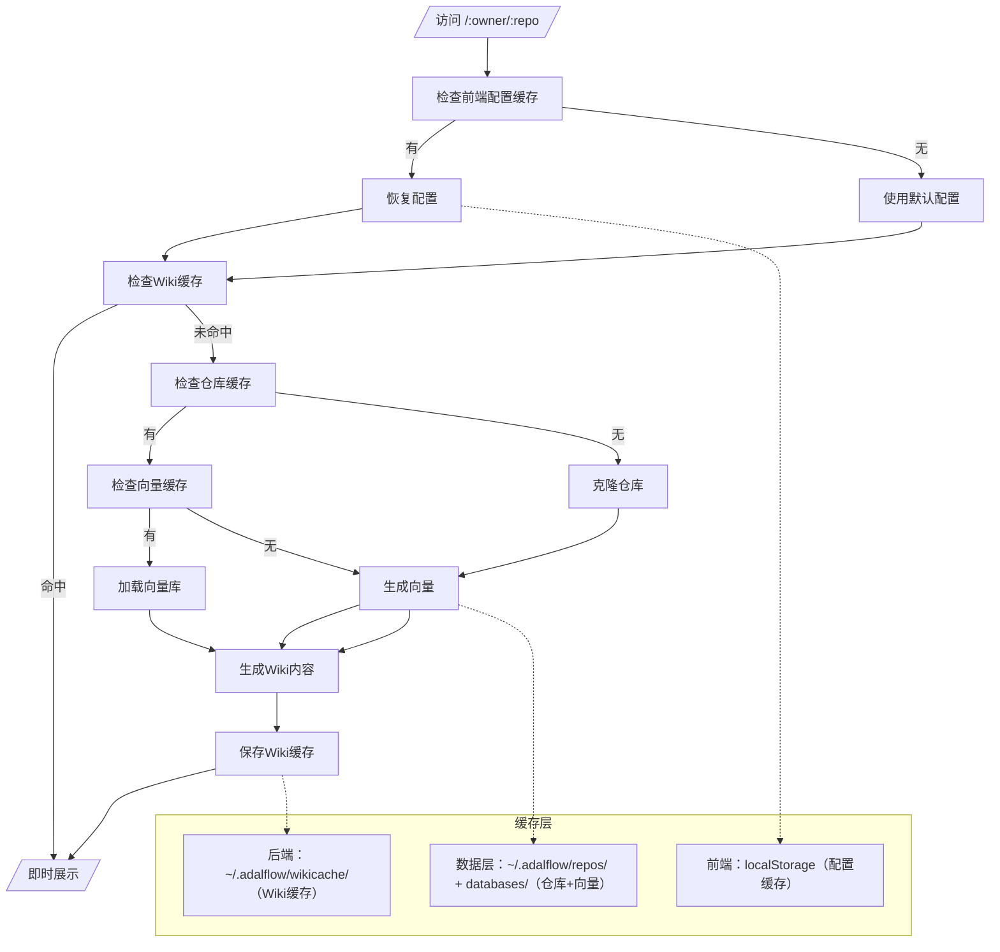

#### 缓存加载过程
当维基页面加载时，系统会执行以下缓存检查：

1.浏览器缓存检查 （前端）：
- 在 `localStorage.deepwikiRepoConfigCache` 中查找已保存的配置
- 恢复提供者、型号、文件过滤器和语言设置

2.Wiki 缓存 API 检查 （后端）：

- Call GET /api/wiki_cache?owner={owner}&repo={repo}&type={type}&language={language}&comprehensive={bool}
- 如果存在缓存，返回包含所有页面内容的完整 WikiStructure。
- 如果没有缓存，返回空

3.仓库缓存检查 （后端）：
- 检查仓库是否存在于 ~/.adalflow/repos/{owner}_{repo}/
- 如果存在且不空，就跳过克隆
- 如果不存在，可以用 download_repo() 克隆

4.嵌入缓存检查 （后端）：

- 检查 ~/.adalflow/databases/{owner}_{repo}.pkl
- 如果存在，则加载 LocalDB.load_state()
- 如果不存在，就创建新的嵌入

#### 缓存保存过程
维基成功生成后，完整结构得以保存：
```typescript
// Construct cache save object
const cacheData = {
  owner,
  repo,
  type: repoType,
  language,
  comprehensive: isComprehensiveView,
  wikiStructure: {
    ...wikiStructure,
    pages: Object.values(generatedPages)  // Include all generated content
  },
  timestamp: new Date().toISOString()
};

// Save to backend cache
await fetch('/api/wiki_cache', {
  method: 'POST',
  headers: { 'Content-Type': 'application/json' },
  body: JSON.stringify(cacheData)
});
```
后端将这些存储在 `~/.adalflow/wikicache/{owner}_{repo}_{type}_{language}_{comprehensive}.json` .

维基生成过程始于确定仓库配置的唯一缓存密钥。缓存密钥包含多个参数，以确保不同配置生成独立缓存。
getCacheKey 函数生成格式为以下格式的键：`deepwiki_cache_{repoType}_{owner}_{repo}_{language}_{comprehensive|concise}`，这确保了不同语言、维基类型或仓库平台不会不当共享缓存内容。


### 1.3 通过 pagesInProgress 状态进行进度跟踪
pagesInProgress 状态用于实时跟踪正在生成的 Wiki 页面，避免重复请求并在 UI 上展示进度。在 src/app/[owner]/[repo]/page.tsx 中，核心使用流程（以 generatePageContent 函数为例）：
```python
const generatePageContent = useCallback(async (page: WikiPage, owner: string, repo: string) => {
  try {
    // 检查页面是否已在处理中，避免重复请求
    if (activeContentRequests.get(page.id)) {
      console.log(`Page ${page.id} is already being processed, skipping`);
      return;
    }

    // 标记页面为"处理中"
    activeContentRequests.set(page.id, true);
    setPagesInProgress(prev => new Set(prev).add(page.id));

    // 页面生成逻辑...

  } finally {
    // 生成完成后移除"处理中"标记
    activeContentRequests.delete(page.id);
    setPagesInProgress(prev => {
      const newSet = new Set(prev);
      newSet.delete(page.id);
      return newSet;
    });
  }
}, []);
```

### 1.4 带受控并发的串行页面生成

受控并发的串行页面生成用于限制同时生成的 Wiki 页面数量，避免资源耗尽（如 API 调用超限、内存占用过高）。在 src/app/[owner]/[repo]/page.tsx 中，其核心逻辑通过队列和递归调用实现（对应 1089-1154 行附近）。
```typescript
// 用于跟踪当前正在处理的页面（避免并发冲突）
const activeContentRequests = useRef(new Map<string, boolean>()).current;

// 串行处理页面生成队列的函数
const processPageQueue = useCallback(async (queue: WikiPage[]) => {
  // 控制并发数（例如每次只处理1个页面）
  const concurrencyLimit = 1;
  let activeCount = 0;
  let index = 0;

  // 递归处理队列
  const processNext = async () => {
    if (index >= queue.length || activeCount >= concurrencyLimit) {
      // 队列处理完成或达到并发上限时退出
      if (activeCount === 0) {
        console.log("All pages in queue processed");
      }
      return;
    }

    activeCount++;
    const page = queue[index];
    index++;

    try {
      // 生成单个页面内容
      await generatePageContent(page, owner, repo);
    } catch (error) {
      console.error(`Failed to generate page ${page.id}:`, error);
    } finally {
      activeCount--;
      // 处理下一个页面
      processNext();
    }
  };

  // 启动并发处理（根据限制启动多个初始任务）
  for (let i = 0; i < concurrencyLimit; i++) {
    processNext();
  }
}, [generatePageContent, owner, repo]);
```
实现细节：
- 并发控制：通过 concurrencyLimit 限制同时生成的页面数量（例如设为 1 则完全串行，设为 3 则允许最多 3 个页面并行生成），避免一次性发起过多请求。
- 队列处理机制：维护一个页面队列 queue，存储需要生成的页面；递归函数 processNext 负责从队列中取出页面并调用 generatePageContent 生成内容；每次生成完成后，通过 activeCount-- 释放并发名额，并继续处理下一个页面。
- 冲突避免：结合 activeContentRequests 跟踪每个页面的处理状态，确保即使队列中存在重复页面 ID，也不会被重复处理。
- 适用场景：当 Wiki 包含大量页面（如 10+）时，该机制可平滑分配资源，避免因一次性处理所有页面导致的性能问题或 API 限流。

---

## 2. 互动聊天（提问组件）
Ask 组件提供实时问答界面，用于查询代码库。用户可以提出关于代码功能、架构或实现细节的问题，并获得由 RAG 驱动的上下文感知回答。
Ask 组件维护一个 conversationHistory 状态，跟踪消息交换，支持上下文后续问题。createChatWebSocket（） 工具函数处理 WebSocket 连接生命周期。

**系统架构：**
聊天和问答系统由一个 React 前端组件（Ask.tsx）组成，通过 WebSocket 和 HTTP 流协议与 FastAPI 后端服务（simple_chat.py）通信。


### 2.1 对话历史管理
对话历史是实现「上下文感知」的核心，其更新逻辑严格遵循「用户发消息 → 追加到历史 → 后端返回回答 → 追加到历史」的流程，关键代码：
```typescript
// 发送用户消息的核心函数
const sendMessage = useCallback(async () => {
  if (!inputValue.trim() || isLoading) return;

  // 1. 生成用户消息对象
  const userMsg: ChatMessage = {
    role: 'user',
    content: inputValue.trim(),
    timestamp: Date.now(),
    id: `msg-${Date.now()}-user`,
  };

  // 2. 追加用户消息到对话历史（UI 立即反馈）
  setConversationHistory(prev => [...prev, userMsg]);
  setInputValue('');
  setIsLoading(true);
  setError(null);

  // 3. 生成助手消息占位（用于流式渲染）
  const assistantMsgId = `msg-${Date.now()}-assistant`;
  currentAssistantMsgIdRef.current = assistantMsgId;
  setConversationHistory(prev => [
    ...prev,
    {
      role: 'assistant',
      content: '', // 初始为空，后续流式填充
      timestamp: Date.now(),
      id: assistantMsgId,
    },
  ]);

  // 4. 通过 WebSocket 发送消息（携带对话历史上下文）
  try {
    if (!wsRef.current || wsRef.current.readyState !== WebSocket.OPEN) {
      // 重建 WebSocket 连接（调用工具函数）
      wsRef.current = createChatWebSocket(repoInfo, handleWsMessage, handleWsError, handleWsClose);
    }
    // 发送数据：包含当前问题 + 对话历史（上下文） + 代码库信息
    wsRef.current.send(
      JSON.stringify({
        question: userMsg.content,
        conversation_history: conversationHistory,
        repo_info: repoInfo, // 关联当前代码库（owner/repo/类型等）
      })
    );
  } catch (err) {
    setError('发送消息失败，请重试');
    setIsLoading(false);
    // 回滚对话历史（移除占位的助手消息）
    setConversationHistory(prev => prev.filter(msg => msg.id !== assistantMsgId));
  }
}, [inputValue, isLoading, conversationHistory, repoInfo]);

// 处理 WebSocket 接收的消息（流式更新助手回答）
const handleWsMessage = useCallback((event: MessageEvent) => {
  const data = JSON.parse(event.data);
  const { type, content, error: wsError } = data;

  if (type === 'error') {
    setError(wsError || '获取回答失败');
    setIsLoading(false);
    // 清空占位的助手消息
    setConversationHistory(prev => prev.filter(msg => msg.id !== currentAssistantMsgIdRef.current));
    return;
  }

  if (type === 'stream' && currentAssistantMsgIdRef.current) {
    // 流式更新助手消息内容（逐字拼接）
    setConversationHistory(prev =>
      prev.map(msg =>
        msg.id === currentAssistantMsgIdRef.current
          ? { ...msg, content: msg.content + content }
          : msg
      )
    );
  }

  if (type === 'complete') {
    // 回答接收完成，结束加载状态
    setIsLoading(false);
    currentAssistantMsgIdRef.current = null;
  }
}, []);
```

### 2.2 后端服务（simple_chat.py）
FastAPI 后端负责处理 WebSocket 连接、执行 RAG 流程、流式返回回答，核心架构：
```python
# simple_chat.py
from fastapi import FastAPI, WebSocket, WebSocketDisconnect
from langchain.chains import RetrievalQA
from langchain.vectorstores import Chroma
from langchain.llms import OpenAI
from langchain.callbacks.streaming_stdout import StreamingStdOutCallbackHandler

app = FastAPI()

# 代码库向量数据库（提前构建：将代码文件拆分、嵌入、存储）
VECTOR_STORE = Chroma(persist_directory="./chroma_db", embedding_function=openai_embedding)

class ChatConnectionManager:
    """管理WebSocket连接"""
    def __init__(self):
        self.active_connections: list[WebSocket] = []

    async def connect(self, websocket: WebSocket):
        await websocket.accept()
        self.active_connections.append(websocket)

    def disconnect(self, websocket: WebSocket):
        self.active_connections.remove(websocket)

    async def send_stream(self, websocket: WebSocket, content: str):
        """流式发送消息"""
        await websocket.send_json({"type": "stream", "content": content})

manager = ChatConnectionManager()

@app.websocket("/chat/ws")
async def chat_websocket(websocket: WebSocket, owner: str, repo: str, type: str):
    await manager.connect(websocket)
    try:
        # 1. 接收前端消息（问题 + 对话历史 + 代码库信息）
        data = await websocket.receive_json()
        question = data["question"]
        conversation_history = data["conversation_history"]
        repo_info = {"owner": owner, "repo": repo, "type": type}

        # 2. 构建RAG检索链（过滤当前代码库的向量数据）
        retriever = VECTOR_STORE.as_retriever(
            search_kwargs={"filter": {"repo": repo, "owner": owner}}
        )
        qa_chain = RetrievalQA.from_chain_type(
            llm=OpenAI(
                streaming=True,
                callbacks=[StreamingStdOutCallbackHandler()],
                temperature=0
            ),
            chain_type="stuff",
            retriever=retriever,
            return_source_documents=True # 返回引用的代码片段
        )

        # 3. 流式执行问答，逐字返回结果
        async for chunk in qa_chain.astream({"query": question}):
            # 过滤空内容
            if chunk["result"].strip():
                await manager.send_stream(websocket, chunk["result"])
        
        # 4. 发送完成信号
        await websocket.send_json({"type": "complete"})

    except WebSocketDisconnect:
        manager.disconnect(websocket)
    except Exception as e:
        # 发送错误信息
        await websocket.send_json({"type": "error", "error": str(e)})
        manager.disconnect(websocket)
```

1. 上下文感知的实现
- **前端**：每次发送消息时，将 `conversationHistory` 完整传给后端，确保后端能基于历史对话理解上下文；
- **后端**：RAG 链可结合对话历史重构 prompt（如 `结合历史对话：{history}，回答当前问题：{question}`），让 LLM 生成连贯的回答。

2. 受控并发与连接稳定性
- **前端**：通过 `isLoading` 状态防止重复发送消息，WebSocket 重连机制确保网络波动后自动恢复；
- **后端**：`ChatConnectionManager` 管理活跃连接，避免连接泄漏；流式返回减少内存占用，支持长文本回答。

3. RAG 精准性保障
- 向量数据库按 `owner/repo` 过滤检索结果，确保只返回当前代码库的相关内容；
- 后端返回的回答可附带「来源代码片段」（前端可展示引用位置），提升回答可信度。

---

## 3. 深度研究模式
深度研究通过多回合调查过程扩展了询问功能，自动连续研究最多5次迭代，直到得出全面结论。
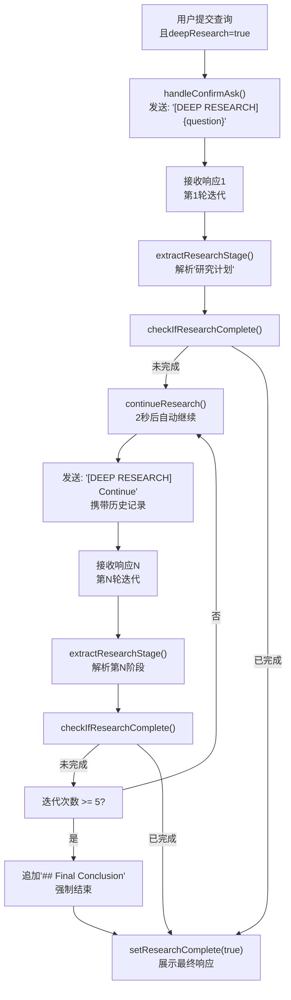

关键研究阶段类型：
- 计划 ——初始研究计划和方法（迭代 1）
- 更新 ——基于之前迭代的研究更新（迭代 1-4）
- 结论 ——最终全面答案

系统通过检查“## 最终结论”或达到最大迭代次数（5）等标记，自动检测完成情况。


关键实施细节：
- 研究迭代跟踪：src/components/Ask.tsx
- 阶段提取：src/components/Ask.tsx
- 自动延续逻辑：src/components/Ask.tsx
- 完备检测：src/components/Ask.tsx
- 研究导航：src/components/Ask.tsx

### 3.1 深度研究提示系统
后端检测 [DEEP RESEARCH] 标签，并应用迭代特定的提示：
**prompt选择逻辑**
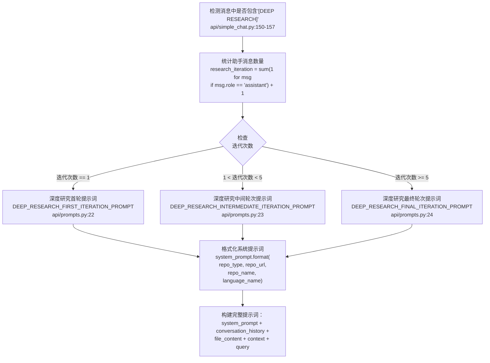

**研究响应结构：**

| 迭代次数 | 提示词模板 | 预期响应格式 | 核心指导原则 |
|---|---|---|---|
| 1 | `DEEP_RESEARCH_FIRST_ITERATION_PROMPT` | `## 研究计划` 后接 `## 下一步行动` | 概述研究方案、明确核心要点、呈现初步发现 |
| 2-4 | `DEEP_RESEARCH_INTERMEDIATE_ITERATION_PROMPT` | `## 研究更新 {迭代次数}` | 基于前期研究展开、填补信息缺口、输出新增洞察 |
| 5+ | `DEEP_RESEARCH_FINAL_ITERATION_PROMPT` | `## 最终结论` | 整合所有研究结果、形成全面结论 |

**研究迭代流程：**
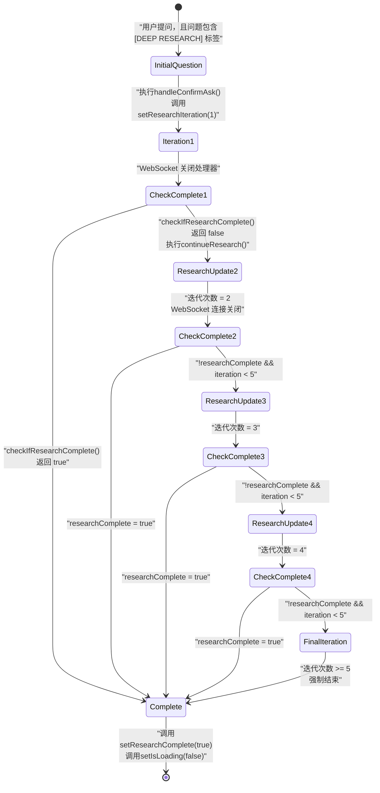

研究流程由 `continueResearch()` 管理：
- 创建带有 [DEEP RESEARCH] 的连续消息
- 增量研究迭代
- 发起新的 WebSocket 请求
- 通过 `extractResearchStage()` 提取并存储研究阶段 

**研究阶段管理**
该系统通过 `ResearchStage` 接口跟踪研究进展：
```typescript
interface ResearchStage {
  title: string;
  content: string;
  iteration: number;
  type: 'plan' | 'update' | 'conclusion';
}
```

### 3.2 研究阶段
研究阶段通过 `extractResearchStage()` 中的模式匹配从人工智能回答中提取：核心目标是**从 AI 生成的非结构化自然语言回答中，通过模式匹配提取出结构化的“深度研究维度信息”**（如研究方向、核心代码逻辑、架构分析、待验证点、风险提示等），将零散的回答转化为可结构化展示、可交互的研究结论。

```typescript
// 核心类型定义（前端/后端通用）
type ResearchDimension = 
  | "code_implementation" // 代码实现细节
  | "architecture_design" // 架构设计分析
  | "performance_risk"    // 性能/安全风险
  | "extension_suggestion"// 扩展优化建议
  | "unverified_point"     // 待验证的结论
  | "related_code"        // 关联代码片段

// 提取结果的结构化类型
interface ResearchStage {
  dimension: ResearchDimension; // 研究维度
  content: string;              // 维度下的核心内容
  codeSnippets?: string[];      // 关联的代码片段（可选）
  sourceFile?: string;          // 代码来源文件（可选）
  confidence: number;           // AI 结论的置信度（0-1）
}

// 函数入参/出参
/**
 * 从 AI 回答文本中提取深度研究阶段的结构化信息
 * @param aiAnswer AI 生成的原始回答文本（RAG 驱动的代码库分析结果）
 * @returns 结构化的研究阶段数组
 */
function extractResearchStage(aiAnswer: string): ResearchStage[];
```

**模式匹配的设计思路**
1. **格式模板匹配**：针对 AI 回答中显式的分段标识（如 `### 代码实现` `#### 架构分析`），通过正则匹配分段内容；
2. **关键词语义匹配**：针对无显式分段但含核心关键词的回答（如“性能风险：xxx”“核心逻辑：xxx”），通过关键词+上下文提取维度内容；
3. **代码片段匹配**：单独识别回答中的代码块（如 ```ts ... ```），关联到对应研究维度。

**完整实现流程（含核心代码）**
步骤 1：文本预处理（统一格式，降低匹配误差）
首先对 AI 原始回答做清洗，消除格式不一致性（如换行、空格、特殊符号、大小写混乱）：
```typescript
function extractResearchStage(aiAnswer: string): ResearchStage[] {
  // 步骤 1：预处理文本
  const cleanedAnswer = aiAnswer
    .replace(/\r\n/g, "\n") // 统一换行符
    .replace(/\s+/g, " ")   // 合并多余空格
    .trim()                 // 去除首尾空格
    .replace(/###+/g, "###");// 统一分段符（如 #### → ###）

  // 存储最终提取结果
  const researchStages: ResearchStage[] = [];

  // 步骤 2：定义模式匹配规则（核心）
  const matchRules: {
    dimension: ResearchDimension;
    pattern: RegExp;        // 匹配正则
    extractor: (match: RegExpMatchArray) => string; // 内容提取器
  }[] = [
    // 规则 1：匹配「### 代码实现」分段
    {
      dimension: "code_implementation",
      pattern: /### 代码实现([\s\S]*?)(?=###|$)/i, // 非贪婪匹配到下一个###或结尾
      extractor: (match) => match[1].trim()
    },
    // 规则 2：匹配「### 架构设计」分段
    {
      dimension: "architecture_design",
      pattern: /### 架构设计([\s\S]*?)(?=###|$)/i,
      extractor: (match) => match[1].trim()
    },
    // 规则 3：匹配「性能风险：xxx」关键词模式
    {
      dimension: "performance_risk",
      pattern: /性能风险[:：]([\s\S]*?)(?=(\n|。|；|$))/i, // 匹配到换行/句号/分号/结尾
      extractor: (match) => match[1].trim()
    },
    // 规则 4：匹配「扩展建议：xxx」关键词模式
    {
      dimension: "extension_suggestion",
      pattern: /扩展建议[:：]([\s\S]*?)(?=(\n|。|；|$))/i,
      extractor: (match) => match[1].trim()
    },
    // 规则 5：匹配「待验证：xxx」关键词模式
    {
      dimension: "unverified_point",
      pattern: /待验证[:：]([\s\S]*?)(?=(\n|。|；|$))/i,
      extractor: (match) => match[1].trim()
    }
  ];

  // 步骤 3：执行模式匹配，提取各维度内容
  matchRules.forEach(({ dimension, pattern, extractor }) => {
    const matches = cleanedAnswer.matchAll(pattern);
    for (const match of matches) {
      const content = extractor(match);
      if (content) { // 过滤空内容
        researchStages.push({
          dimension,
          content,
          codeSnippets: extractCodeSnippets(content), // 单独提取代码片段
          confidence: 0.9, // 格式匹配的置信度默认高
          sourceFile: extractSourceFile(content)      // 提取代码来源文件
        });
      }
    }
  });

  // 步骤 4：兜底匹配（无显式分段/关键词时的语义兜底）
  if (researchStages.length === 0) {
    // 若未匹配到任何维度，默认归类为「代码实现」
    researchStages.push({
      dimension: "code_implementation",
      content: cleanedAnswer,
      codeSnippets: extractCodeSnippets(cleanedAnswer),
      confidence: 0.7,
      sourceFile: null
    });
  }

  // 步骤 5：去重与校验（避免重复维度）
  const uniqueStages = Array.from(
    new Map(researchStages.map(s => [s.dimension, s])).values()
  );

  return uniqueStages;
}
```

步骤 4：辅助函数（代码片段/来源文件提取）
为了让提取结果更精准，配套实现 `extractCodeSnippets` 和 `extractSourceFile` 辅助函数，专门处理代码相关信息：
```typescript
/**
 * 从文本中提取代码片段（匹配 ```xxx ``` 格式）
 */
function extractCodeSnippets(text: string): string[] {
  const codePattern = /```([\s\S]*?)```/g;
  const snippets: string[] = [];
  let match;
  while ((match = codePattern.exec(text)) !== null) {
    snippets.push(match[1].trim());
  }
  return snippets;
}

/**
 * 从文本中提取代码来源文件（匹配「文件：xxx.ts」「路径：xxx.js」等）
 */
function extractSourceFile(text: string): string | null {
  const filePattern = /(文件|路径)[:：]([\w\/\.\-]+)/i;
  const match = text.match(filePattern);
  return match ? match[2].trim() : null;
}
```

**置信度分级**
- 格式匹配（如 `### 代码实现`）：置信度 0.9；
- 关键词匹配（如“性能风险：xxx”）：置信度 0.8；
- 兜底匹配：置信度 0.7；
前端可根据置信度展示不同样式（如高置信度标绿、低置信度标黄）。

**后端协同优化**
为了提升匹配准确率，后端（simple_chat.py）会在生成回答时，通过 Prompt 约束 AI 遵循固定格式：
```python
# 后端 Prompt 示例（约束 AI 回答格式）
PROMPT_TEMPLATE = """
分析代码库 {repo} 的 {question} 问题，按以下格式输出：
### 代码实现
<核心代码实现细节>
### 架构设计
<架构设计分析>
### 性能风险
<潜在性能/安全风险>
### 扩展建议
<优化/扩展建议>
回答中若涉及代码片段，请用 ``` 包裹，并标注来源文件（如「文件：src/app/page.tsx」）。
"""
```
前端 `extractResearchStage()` 与后端 Prompt 格式强绑定，形成“格式约束 → 模式提取 → 结构化展示”的闭环。

**研究完成检测**
`checkIfResearchComplete()` 函数分析响应内容以获取完成指标，完成检测逻辑：
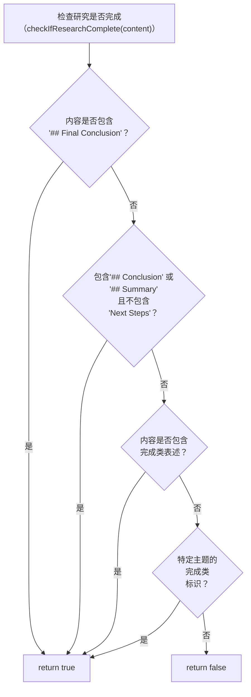
| 类型 | 标识内容 | 来源 |
|---|---|---|
| 明确标识 | `\"## Final Conclusion\"` | 第178行 |
| 章节标题 | `\"## Conclusion\"`、`\"## Summary\"` 且不包含 `\"Next Steps\"` 或 `\"next iteration\"` | 第183-189行 |
| 完成类表述 | `\"This concludes our research\"`、`\"This completes our investigation\"`、`\"Key Findings and Implementation Details\"` | 第191-197行 |
| 特定主题标识 | Dockerfile分析（无后续延续标识） | 第201-207行 |
| 强制完成机制 | 迭代5次后，追加完成说明 | 第381-392行 |

### 3.3 请求处理流水线（后端处理流程）
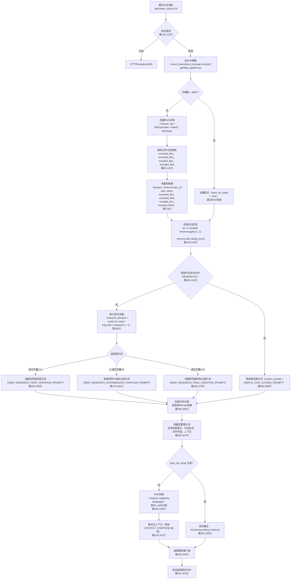

---

## 4. RAG（检索增强生成）系统

RAG 系统通过在生成答案前提取相关代码片段，实现上下文感知的 AI 响应。这使 AI 的响应基于实际代码库内容。

**RAG 流水线架构**
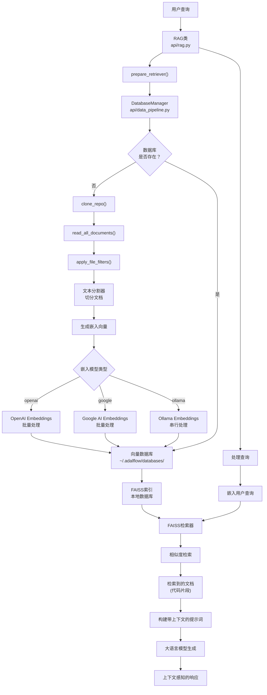

### 4.1 RAG集成
聊天系统与 RAG（检索增强生成）系统集成，基于存储库内容提供上下文响应。
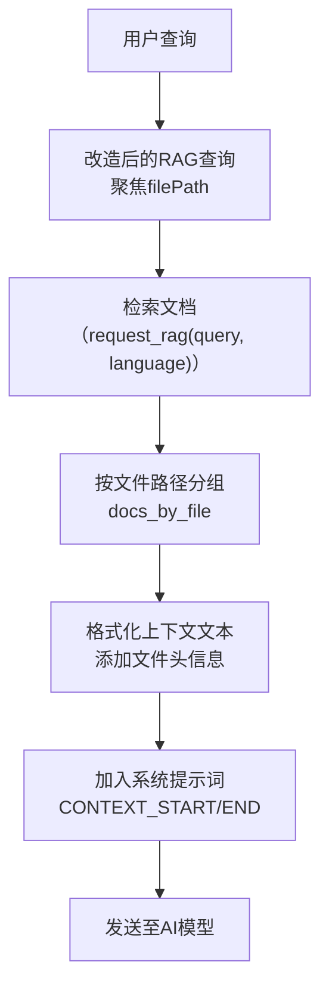

### 4.2 内存集成
对话历史通过 `add_dialog_turn()` 存储在 RAG 系统的内存中：
```typescript
for (let i = 0; i < messages.length - 1; i += 2) {
  if (i + 1 < messages.length) {
    const userMsg = messages[i];
    const assistantMsg = messages[i + 1];
    
    if (userMsg.role === "user" && assistantMsg.role === "assistant") {
      request_rag.memory.add_dialog_turn(
        user_query: userMsg.content,
        assistant_response: assistantMsg.content
      );
    }
  }
}
```
前端维护本地对话状态，而后端通过 RAG 内存系统处理，确保请求间上下文一致。

---

## 5. 仓库处理与文件过滤
存储库处理将原始存储库内容转换为结构化、可搜索的数据。这包括克隆、过滤、token化和文档准备。

处理流程：
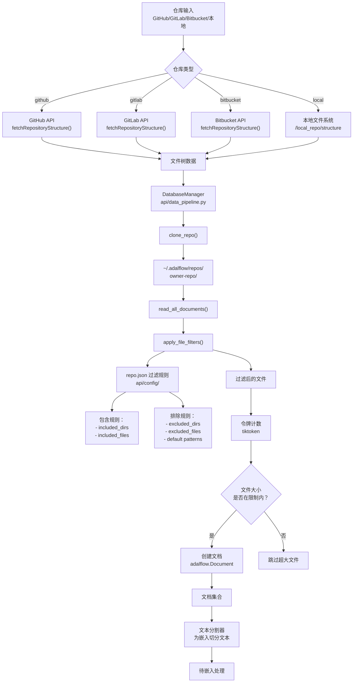
**默认排除模式：**
Build artifacts: dist/, build/, out/, target/
Dependencies: node_modules/, vendor/, venv/, .venv/
Version control: .git/, .svn/, .hg/
IDE files: .idea/, .vscode/, *.pyc, *.class

**关键实施细节：**
- 文件树获取：src/app/[owner]/[repo]/page.tsx：1167-1481
- 过滤参数：src/app/[owner]/[repo]/page.tsx：249-256
- 大小限制的token计数：使用 tiktoken 库
- 文档创建：使用 Adalflow.Document类


# 功能集成示例
下序列图展示了当用户生成带有“询问”功能的维基时，多个核心功能如何协同工作：
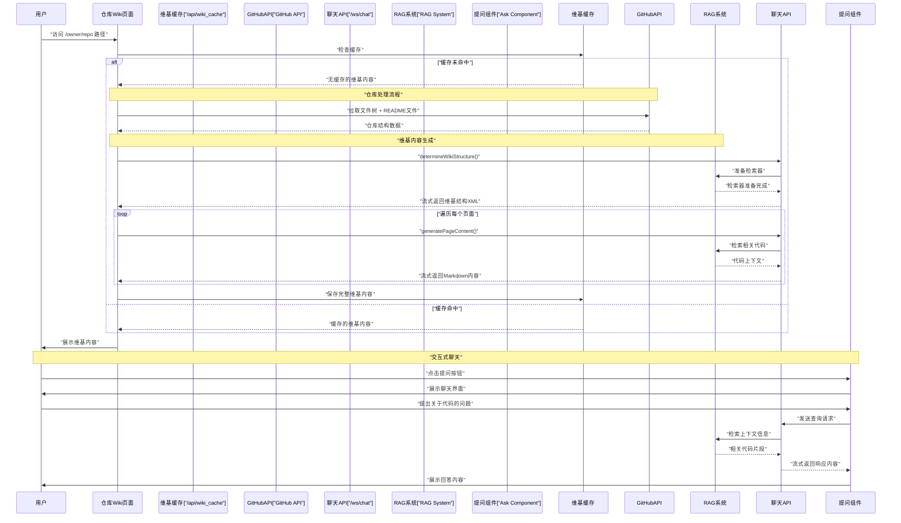

